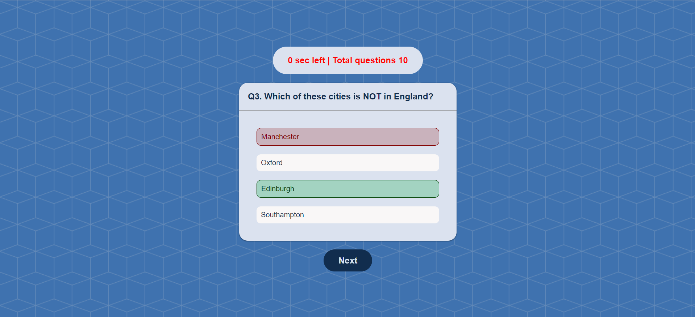

# Interactive Quiz Game

A quiz game where users can answer questions fetched from an API.
The game will display questions one by one, allow users to select answers, and provide
feedback on their performance.


## Tech Stack

**Client:** HTML, CSS, JavaScript

**Server:** Java 17, Springboot 6

**Database:** MySQL version 5.7.8 or higher


## Screenshots





## UML Diagrams
### Flow Diagram


### Use Case Diagram


### ER Diagram


### Relational Diagram


## Installation

### Frontend

Step 1: Install live server extension in Vs Code.

Step 2: Open **/projects/capstone-projects/_2_Interactive_Quiz_Game_With_Backend/client in Vs Code

Step 3: Open index.html file in Vs Code.

Step 4: Click on Go Live button.

Step 5: Now the frontend will be running on "http://127.0.0.1:5500/"

### Backend
#### Create Database Schema in MySQL version 5.7.8 or higher

```sql
CREATE DATABASE IF NOT EXISTS `quiz_db`;

USE `quiz_db`;

CREATE TABLE IF NOT EXISTS `category` (
    `category_id`   INT AUTO_INCREMENT PRIMARY KEY,
    `name`          VARCHAR(100)    NOT NULL
);

CREATE TABLE IF NOT EXISTS `question` (
    `question_id`   	INT AUTO_INCREMENT PRIMARY KEY,
    `category_id`   	INT     		NOT NULL,
    `type`				VARCHAR(20)		NOT NULL,
    `difficulty`		VARCHAR(10)		NOT NULL,
    `question`			VARCHAR(500) 	NOT NULL,
    `correct_answer`	VARCHAR(200)	NOT NULL,
    `options`			JSON			NOT NULL,
    
    FOREIGN KEY(`category_id`) REFERENCES `category` (`category_id`)
);
```

#### Inside application.yml, Use your database credentials (url, username, password)
```yml
server:
  port: 8080
spring:
  application:
    name: "quizify"
  datasource:
    url: jdbc:mysql://localhost:3306/quiz_db
    username: "root"
    password: "root"
  jpa:
    show-sql: true
    sql:
      init:
        mode: always

```

#### Start your server
Step 1: Open **/projects/capstone-projects/_2_Interactive_Quiz_Game_With_Backend/server inside IntelliJ Idea

Step 2: Load mevan dependencies

Step 3: Run "QuizifyApplication.java" file using IntelliJ Idea


## API Reference

#### Get all categories

```http
  GET /api/categories
```

#### Get questions

```http
  GET /api/questions
```

| Parameter | Type     | Description                |
| :-------- | :------- | :------------------------- |
| `categoryId` | `int` | Fetch questions based on category id |
| `difficulty` | `string` | Fetch questions based on difficulty: easy, medium, hard |


#### Insert new questions

```http
  POST /api/questions
```

#### Request body

```javascript
[
  {
    "categoryId": 1,
    "type": "multiple",
    "difficulty": "easy",
    "question": "What is the surname of Suraj",
    "correctAnswer": "Dunerya",
    "options": [
      "Dunerya",
      "Verma",
      "Sharma",
      "Agrawal"
    ]
  }
  
]
```

    
## Insert data into database

### category table

```sql
INSERT INTO `category` (`name`) VALUES
('General Knowledge'),
('Sports'),
('Geography'),
('History'),
('Politics'),
('Science & Nature'),
('Science: Computers'),
('Science: Mathematics');
```

### question table

```sql
INSERT INTO `question` (`category_id`, `type`, `difficulty`, `question`, `correct_answer`, `options`) VALUES
(1, 'multiple', 'easy', 'What airline was the owner of the plane that crashed off the coast of Nova Scotia in 1998?', 'Swiss Air', json_array('Swiss Air', 'Air France', 'British Airways', 'TWA')),
(1, 'multiple', 'easy', 'Who is the youngest person to receive a Nobel Prize?', 'Malala Yousafzai', JSON_ARRAY('Lawrence Bragg', 'Werner Heisenberg', 'Yasser Arafat', 'Malala Yousafzai')),
(1, 'multiple', 'easy', 'In past times, what would a gentleman keep in his fob pocket?', 'Watch', JSON_ARRAY('Money', 'Keys', 'Notebook', 'Watch')),
(1, 'multiple', 'easy', 'Earth is located in which galaxy?', 'The Milky Way Galaxy', JSON_ARRAY('The Mars Galaxy', 'The Galaxy Note', 'The Black Hole', 'The Milky Way Galaxy')),
(1, 'multiple', 'easy', 'What is the largest organ of the human body?', 'Skin', JSON_ARRAY('Heart', 'Large Intestine', 'Liver', 'Skin')),
(1, 'multiple', 'easy', 'Which of the following blood component forms a plug at the site of injuries?', 'Platelets', JSON_ARRAY('Red blood cells', 'White blood cells', 'Blood plasma', 'Platelets')),
(1, 'multiple', 'easy', 'Virgin Trains, Virgin Atlantic and Virgin Racing, are all companies owned by which famous entrepreneur?', 'Richard Branson', JSON_ARRAY('Alan Sugar', 'Donald Trump', 'Bill Gates', 'Richard Branson')),
(1, 'multiple', 'easy', 'What does a funambulist walk on?', 'A Tight Rope', JSON_ARRAY('Broken Glass', 'Balls', 'The Moon', 'A Tight Rope')),
(1, 'multiple', 'easy', 'Which of the following is not the host of a program on NPR?', 'Ben Shapiro', JSON_ARRAY('Terry Gross', 'Ira Glass', 'Peter Sagal', 'Ben Shapiro')),
(1, 'multiple', 'easy', 'The likeness of which president is featured on the rare $2 bill of USA currency?', 'Thomas Jefferson', JSON_ARRAY('Martin Van Buren', 'Ulysses Grant', 'John Quincy Adams', 'Thomas Jefferson')),
(1, 'multiple', 'easy', 'The drug cartel run by Pablo Escobar originated in which South American city?', 'Medellín', JSON_ARRAY('Bogotá', 'Quito', 'Cali', 'Medellín')),
(1, 'multiple', 'easy', 'What is the name of the Jewish New Year?', 'Rosh Hashanah', JSON_ARRAY('Elul', 'New Year', 'Succoss', 'Rosh Hashanah')),
(1, 'multiple', 'easy', "Waluigi's first appearance was in what game?", 'Mario Tennis 64 (N64)', JSON_ARRAY('Wario Land: Super Mario Land 3', 'Mario Party (N64)', 'Super Smash Bros. Ultimate', 'Mario Tennis 64 (N64)')),
(1, 'multiple', 'easy', 'Who is the author of Jurassic Park?', 'Michael Crichton', JSON_ARRAY('Peter Benchley', 'Chuck Paluhniuk', 'Irvine Welsh', 'Michael Crichton')),
(1, 'multiple', 'easy', 'What is the nickname of the US state of California?', 'Golden State', JSON_ARRAY('Sunshine State', 'Bay State', 'Treasure State', 'Golden State')),
(1, 'multiple', 'easy', 'According to Sherlock Holmes, "If you eliminate the impossible, whatever remains, however improbable, must be the..."', 'Truth', JSON_ARRAY('Answer', 'Cause', 'Source', 'Truth')),
(1, 'multiple', 'easy', "What is the closest planet to our solar system's sun?", 'Mercury', JSON_ARRAY('Mars', 'Jupiter', 'Earth', 'Mercury')),
(1, 'multiple', 'easy', 'Which American-owned brewery led the country in sales by volume in 2015?', 'D. G. Yuengling and Son, Inc', JSON_ARRAY('Anheuser Busch', 'Boston Beer Company', 'Miller Coors', 'D. G. Yuengling and Son, Inc')),
(1, 'multiple', 'easy', 'What was the nickname given to the Hughes H-4 Hercules, a heavy transport flying boat which achieved flight in 1947?', 'Spruce Goose', JSON_ARRAY("Noah's Ark", 'Fat Man', 'Trojan Horse', 'Spruce Goose')),
(1, 'multiple', 'easy', 'When one is "envious", they are said to be what color?', 'Green', JSON_ARRAY('Red', 'Blue', 'Yellow', 'Green')),
(1, 'multiple', 'easy', 'Which sign of the zodiac is represented by the Crab?', 'Cancer', JSON_ARRAY('Libra', 'Virgo', 'Sagittarius', 'Cancer')),
(1, 'multiple', 'easy', 'What do the letters of the fast food chain KFC stand for?', 'Kentucky Fried Chicken', JSON_ARRAY('Kentucky Fresh Cheese', 'Kibbled Freaky Cow', 'Kiwi Food Cut', 'Kentucky Fried Chicken')),
(1, 'multiple', 'easy', 'The "fairy" type made its debut in which generation of the Pokemon core series games?', '6th', JSON_ARRAY('2nd', '7th', '4th', '6th')),
(1, 'multiple', 'easy', 'Who invented the first ever chocolate bar, in 1847?', 'Joseph Fry', JSON_ARRAY('Andrew Johnson', 'John Cadbury', 'John Tyler', 'Joseph Fry')),
(1, 'multiple', 'easy', 'What is the name of Poland in Polish?', 'Polska', JSON_ARRAY('Pupcia', 'Polszka', 'Póland', 'Polska')),
(1, 'multiple', 'easy', 'The Flag of the European Union has how many stars on it?', '12', JSON_ARRAY('10', '14', '16', '12')),
(1, 'multiple', 'easy', 'What zodiac sign is represented by a pair of scales?', 'Libra', JSON_ARRAY('Aries', 'Capricorn', 'Sagittarius', 'Libra')),
(1, 'multiple', 'easy', 'How many colors are there in a rainbow?', '7', JSON_ARRAY('8', '9', '10', '7')),
(1, 'multiple', 'easy', 'If you are caught "Goldbricking", what are you doing wrong?', 'Slacking', JSON_ARRAY('Smoking', 'Stealing', 'Cheating', 'Slacking')),
(1, 'multiple', 'easy', "What is the profession of Elon Musk's mom, Maye Musk?", 'Model', JSON_ARRAY('Professor', 'Biologist', 'Musician', 'Model')),
(1, 'multiple', 'easy', "What is on display in the Madame Tussaud's museum in London?", 'Wax sculptures', JSON_ARRAY('Designer clothing', 'Unreleased film reels', 'Vintage cars', 'Wax sculptures')),
(1, 'multiple', 'easy', 'Which American president appears on a one dollar bill?', 'George Washington', JSON_ARRAY('Thomas Jefferson', 'Abraham Lincoln', 'Benjamin Franklin', 'George Washington')),
(1, 'multiple', 'easy', 'What was the name of the WWF professional wrestling tag team made up of the wrestlers Ax and Smash?', 'Demolition', JSON_ARRAY('The Dream Team', 'The Bushwhackers', 'The British Bulldogs', 'Demolition')),
(1, 'multiple', 'easy', 'Which chemical element, number 11 in the Periodic table, has the symbol Na?', 'Sodium', JSON_ARRAY('Carbon', 'Lead', 'Nitrogen', 'Sodium')),
(1, 'multiple', 'easy', 'How would one say goodbye in Spanish?', 'Adiós', JSON_ARRAY('Hola', 'Au Revoir', 'Salir', 'Adiós')),
(1, 'multiple', 'easy', 'What alcoholic drink is made from molasses?', 'Rum', JSON_ARRAY('Gin', 'Vodka', 'Whisky', 'Rum')),
(1, 'multiple', 'easy', 'What does the \'S\' stand for in the abbreviation SIM, as in SIM card? ', 'Subscriber', JSON_ARRAY('Single', 'Secure', 'Solid', 'Subscriber')),
(1, 'multiple', 'easy', 'Who is depicted on the US hundred dollar bill?', 'Benjamin Franklin', JSON_ARRAY('George Washington', 'Abraham Lincoln', 'Thomas Jefferson', 'Benjamin Franklin')),
(1, 'multiple', 'easy', 'How many furlongs are there in a mile?', 'Eight', JSON_ARRAY('Two', 'Four', 'Six', 'Eight')),
(1, 'multiple', 'easy', 'Foie gras is a French delicacy typically made from what part of a duck or goose?', 'Liver', JSON_ARRAY('Heart', 'Stomach', 'Intestines', 'Liver')),
(1, 'multiple', 'easy', 'When was the Playstation 3 released?', 'November 11, 2006', JSON_ARRAY('January 8, 2007', 'December 25, 2007', 'July 16, 2006', 'November 11, 2006')),
(1, 'multiple', 'easy', 'Which country has the union jack in its flag?', 'New Zealand', JSON_ARRAY('South Africa', 'Canada', 'Hong Kong', 'New Zealand')),
(1, 'multiple', 'easy', 'According to the nursery rhyme, what fruit did Little Jack Horner pull out of his Christmas pie?', 'Plum', JSON_ARRAY('Apple', 'Peach', 'Pear', 'Plum')),
(1, 'multiple', 'easy', 'What do the letters in the GMT time zone stand for?', 'Greenwich Mean Time', JSON_ARRAY('Global Meridian Time', 'General Median Time', 'Glasgow Man Time', 'Greenwich Mean Time')),
(1, 'multiple', 'easy', 'In Half-Life, what is the name of the alien that attaches to heads?', 'Headcrab', JSON_ARRAY('Bullsquid', 'Vortigaunt', 'Facehugger', 'Headcrab')),
(1, 'multiple', 'easy', 'Which country, not including Japan, has the most people of Japanese descent?', 'Brazil', JSON_ARRAY('China', 'South Korea', 'United States of America', 'Brazil')),
(1, 'multiple', 'easy', "What is the name of NASA's most famous space telescope?", 'Hubble Space Telescope', JSON_ARRAY('Big Eye', 'Death Star', 'Millennium Falcon', 'Hubble Space Telescope')),
(1, 'multiple', 'easy', 'What word represents the letter \'T\' in the NATO phonetic alphabet?', 'Tango', JSON_ARRAY('Target', 'Taxi', 'Turkey', 'Tango')),
(1, 'multiple', 'easy', 'What type of animal was Harambe, who was shot after a child fell into its enclosure at the Cincinnati Zoo?', 'Gorilla', JSON_ARRAY('Tiger', 'Panda', 'Crocodile', 'Gorilla')),
(1, 'multiple', 'easy', 'What geometric shape is generally used for stop signs?', 'Octagon', JSON_ARRAY('Hexagon', 'Circle', 'Triangle', 'Octagon'));


INSERT INTO `question` (`category_id`, `type`, `difficulty`, `question`, `correct_answer`, `options`) VALUES
(1, 'multiple', 'medium', "Which of the General Mills Corporation's monster cereals was the last to be released in the 1970's?", 'Fruit Brute', json_array('Fruit Brute', 'Count Chocula', 'Franken Berry', 'Boo-Berry')),
(1, 'multiple', 'medium', 'Scotch whisky and Drambuie make up which cocktail?', 'Rusty Nail', json_array('Rusty Nail', 'Screwdriver', 'Sex on the Beach', 'Manhattan')),
(1, 'multiple', 'medium', "What is the world's most expensive spice by weight?", 'Saffron', json_array('Saffron', 'Cinnamon', 'Cardamom', 'Vanilla')),
(1, 'multiple', 'medium', 'What was the soft drink Pepsi originally introduced as?', "Brad's Drink", json_array("Brad's Drink", 'Pepsin Pop', 'Carolina Cola', 'Pepsin Syrup')),
(1, 'multiple', 'medium', 'When was the Declaration of Independence approved by the Second Continental Congress?', 'July 4, 1776', json_array('July 4, 1776', 'May 4, 1776', 'June 4, 1776', 'July 2, 1776')),
(1, 'multiple', 'medium', 'Rolex is a company that specializes in what type of product?', 'Watches', json_array('Watches', 'Cars', 'Computers', 'Sports equipment')),
(1, 'multiple', 'medium', 'What country saw a world record 315 million voters turn out for elections on May 20, 1991?', 'India', json_array('India', 'United States of America', 'Soviet Union', 'Poland')),
(1, 'multiple', 'medium', 'What is the currency of Poland?', 'Złoty', json_array('Złoty', 'Ruble', 'Euro', 'Krone')),
(1, 'multiple', 'medium', 'What is the full title of the Prime Minister of the UK?', 'First Lord of the Treasury', json_array('First Lord of the Treasury', 'Duke of Cambridge', "Her Majesty's Loyal Opposition", 'Manager of the Crown Estate')),
(1, 'multiple', 'medium', 'What was the destination of the missing flight MH370?', 'Beijing', json_array('Beijing', 'Kuala Lumpur', 'Singapore', 'Tokyo')),
(1, 'multiple', 'medium', 'After how many years would you celebrate your crystal anniversary?', '15', json_array('15', '20', '10', '25')),
(1, 'multiple', 'medium', 'Which country drives on the left side of the road?', 'Japan', json_array('Japan', 'Germany', 'Russia', 'China')),
(1, 'multiple', 'medium', 'Frank Lloyd Wright was the architect behind what famous building?', 'The Guggenheim', json_array('The Guggenheim', 'Villa Savoye', 'Sydney Opera House', 'The Space Needle')),
(1, 'multiple', 'medium', 'When was Hubba Bubba first introduced?', '1979', json_array('1979', '1984', '1972', '1980')),
(1, 'multiple', 'medium', 'The architect known as Le Corbusier was an important figure in what style of architecture?', 'Modernism', json_array('Modernism', 'Neoclassical', 'Baroque', 'Gothic Revival')),
(1, 'multiple', 'medium', 'Which of the following buildings is an example of a structure primarily built in the Art Deco architectural style?', 'Niagara Mohawk Building', json_array('Niagara Mohawk Building', 'Taipei 101', 'One Detroit Center', 'Westendstrasse 1')),
(1, 'multiple', 'medium', 'What fast food chain has the most locations globally?', 'Subway', json_array('Subway', 'Starbucks', 'McDonalds', 'KFC')),
(1, 'multiple', 'medium', 'What was the original name of the search engine "Google"?', 'BackRub', json_array('BackRub', 'CatMassage', 'SearchPro', 'Netscape Navigator')),
(1, 'multiple', 'medium', 'According to the BBPA, what is the most common pub name in the UK?', 'Red Lion', json_array('Red Lion', 'Royal Oak', 'White Hart', "King's Head")),
(1, 'multiple', 'medium', 'Which iconic Disneyland attraction was closed in 2017 to be remodeled as a "Guardians of the Galaxy" themed ride?', 'Twilight Zone Tower of Terror', json_array('Twilight Zone Tower of Terror', 'The Haunted Mansion', 'Pirates of the Caribbean', "Peter Pan's Flight")),
(1, 'multiple', 'medium', 'What character was once considered to be the 27th letter of the alphabet?', 'Ampersand', json_array('Ampersand', 'Interrobang', 'Tilde', 'Pilcrow')),
(1, 'multiple', 'medium', "Which slogan did the fast food company, McDonald's, use before their 'I am Loving It' slogan?", 'We Love to See You Smile', json_array('We Love to See You Smile', 'Why Pay More!?', 'Have It Your Way', 'Making People Happy Through Food')),
(1, 'multiple', 'medium', 'What is the German word for "spoon"?', 'Löffel', json_array('Löffel', 'Gabel', 'Messer', 'Essstäbchen')),
(1, 'multiple', 'medium', 'In 2013 how much money was lost by Nigerian scams?', '$12.7 Billion', json_array('$12.7 Billion', '$95 Million', '$956 Million', '$2.7 Billion')),
(1, 'multiple', 'medium', "What is the name of the popular animatronic singing fish prop, singing such hits such as 'Don't Worry, Be Happy'?", 'Big Mouth Billy Bass', json_array('Big Mouth Billy Bass', 'Big Billy Bass', 'Singing Fish', 'Sardeen')),
(1, 'multiple', 'medium', 'When did the website "Facebook" launch?', '2004', json_array('2004', '2005', '2003', '2006')),
(1, 'multiple', 'medium', 'Earl Grey tea is black tea flavoured with what?', 'Bergamot oil', json_array('Bergamot oil', 'Lavender', 'Vanilla', 'Honey')),
(1, 'multiple', 'medium', 'Which of these words means "idle spectator"?', 'Gongoozler', json_array('Gongoozler', 'Gossypiboma', 'Jentacular', 'Meupareunia')),
(1, 'multiple', 'medium', 'What is a dead mall?', 'A mall with high vacancy rates or low consumer foot traffic', json_array('A mall with high vacancy rates or low consumer foot traffic', 'A mall with no stores', 'A mall that has been condemned', 'A mall after business hours')),
(1, 'multiple', 'medium', 'Which Italian automobile manufacturer gained majority control of U.S. automobile manufacturer Chrysler in 2011?', 'Fiat', json_array('Fiat', 'Maserati', 'Alfa Romeo', 'Ferrari')),
(1, 'multiple', 'medium', 'What does a milliner make and sell?', 'Hats', json_array('Hats', 'Shoes', 'Belts', 'Shirts')),
(1, 'multiple', 'medium', 'Whose greyscale face is on the kappa emoticon on Twitch?', 'Josh DeSeno', json_array('Josh DeSeno', 'Justin DeSeno', 'John DeSeno', 'Jimmy DeSeno')),
(1, 'multiple', 'medium', 'What is the name of the very first video uploaded to YouTube?', 'Me at the zoo', json_array('Me at the zoo', 'tribute', 'carrie rides a truck', 'Her new puppy from great grandpa vern.')),
(1, 'multiple', 'medium', 'Which essential condiment is also known as Japanese horseradish?', 'Wasabi ', json_array('Wasabi ', 'Mentsuyu', 'Karashi', 'Ponzu')),
(1, 'multiple', 'medium', 'Which American manufactured submachine gun was informally known by the American soldiers that used it as "Grease Gun"?', 'M3', json_array('M3', 'Colt 9mm', 'Thompson', 'MAC-10')),
(1, 'multiple', 'medium', 'What is the last letter of the Greek alphabet?', 'Omega', json_array('Omega', 'Mu', 'Epsilon', 'Kappa')),
(1, 'multiple', 'medium', 'What is the star sign of someone born on Valentines day?', 'Aquarius', json_array('Aquarius', 'Pisces', 'Capricorn', 'Scorpio')),
(1, 'multiple', 'medium', 'What was the name given to Japanese military dictators who ruled the country through the 12th and 19th Century?', 'Shogun', json_array('Shogun', 'Ninja', 'Samurai', 'Shinobi')),
(1, 'multiple', 'medium', 'A doctor with a PhD is a doctor of what?', 'Philosophy', json_array('Philosophy', 'Psychology', 'Phrenology', 'Physical Therapy')),
(1, 'multiple', 'medium', 'What alcoholic drink is mainly made from juniper berries?', 'Gin', json_array('Gin', 'Vodka', 'Rum', 'Tequila')),
(1, 'multiple', 'medium', "According to the United States's CDC, one in how many Americans die annually due to smoking?", 'Five', json_array('Five', 'Twenty', 'Ten', 'One hundred')),
(1, 'multiple', 'medium', 'What is the romanized Russian word for "winter"?', 'Zima', json_array('Zima', 'Leto', 'Vesna', "Osen")),
(1, 'multiple', 'medium', 'What is the name given to Indian food cooked over charcoal in a clay oven?', 'Tandoori', json_array('Tandoori', 'Biryani', 'Pani puri', 'Tiki masala')),
(1, 'multiple', 'medium', 'This field is sometimes known as "The Dismal Science."', 'Economics', json_array('Economics', 'Philosophy', 'Politics', 'Physics')),
(1, 'multiple', 'medium', 'Where does water from Poland Spring water bottles come from?', 'Maine, United States', json_array('Maine, United States', 'Hesse, Germany', 'Masovia, Poland', 'Bavaria, Poland')),
(1, 'multiple', 'medium', 'Which item of clothing is usually worn by a Scotsman at a wedding?', 'Kilt', json_array('Kilt', 'Skirt', 'Dress', 'Rhobes')),
(1, 'multiple', 'medium', 'What is the unit of currency in Laos?', 'Kip', json_array('Kip', 'Ruble', 'Konra', 'Dollar')),
(1, 'multiple', 'medium', 'What is the average life span of a garden ant?', '15 years', json_array('15 years', '24 hours', '1 week', '3 years')),
(1, 'multiple', 'medium', 'What is the Portuguese word for "Brazil"?', 'Brasil', json_array('Brasil', 'Brazil', 'Brasilia', 'Brasíl')),
(1, 'multiple', 'medium', 'Which river flows through the Scottish city of Glasgow?', 'Clyde', json_array('Clyde', 'Tay', 'Dee', 'Tweed'));


INSERT INTO `question` (`category_id`, `type`, `difficulty`, `question`, `correct_answer`, `options`) VALUES
(1, 'multiple', 'hard', 'Named after the mallow flower, mauve is a shade of what?', 'Purple', JSON_ARRAY('Purple', 'Red', 'Brown', 'Pink')),
(1, 'multiple', 'hard', 'Which product did Nokia, the telecommunications company, originally sell?', 'Paper', JSON_ARRAY('Paper', 'Phones', 'Computers', 'Processors')),
(1, 'multiple', 'hard', 'The Swedish word "Grunka" means what in English?', 'Thing', JSON_ARRAY('Thing', 'People', 'Place', 'Pineapple')),
(1, 'multiple', 'hard', "Located in Chile, El Teniente is the world's largest underground mine for what metal?", 'Copper', JSON_ARRAY('Copper', 'Iron', 'Nickel', 'Silver')),
(1, 'multiple', 'hard', "What was the third country to have a McDonald's restaurant?", 'Costa Rica', JSON_ARRAY('Costa Rica', 'Japan', 'France', 'Australia')),
(1, 'multiple', 'hard', 'Who founded the Khan Academy?', 'Sal Khan', JSON_ARRAY('Sal Khan', 'Ben Khan', 'Kitt Khan', 'Adel Khan')),
(1, 'multiple', 'hard', 'How many notes are there on a standard grand piano?', '88', JSON_ARRAY('88', '98', '108', '78')),
(1, 'multiple', 'hard', 'Sciophobia is the fear of what?', 'Shadows', JSON_ARRAY('Shadows', 'Eating', 'Bright lights', 'Transportation')),
(1, 'multiple', 'hard', 'Which of the following languages does NOT use gender as a part of its grammar?', 'Turkish', JSON_ARRAY('Turkish', 'German', 'Danish', 'Polish')),
(1, 'multiple', 'hard', 'If someone said "you are olid", what would they mean?', 'You smell extremely unpleasant.', JSON_ARRAY('You smell extremely unpleasant.', 'You are out of shape/weak.', 'Your appearance is repulsive.', 'You are incomprehensible/an idiot.')),
(1, 'multiple', 'hard', 'Virtual reality company Oculus VR lost which of its co-founders in a freak car accident in 2013?', 'Andrew Scott Reisse', JSON_ARRAY('Andrew Scott Reisse', 'Nate Mitchell', 'Jack McCauley', 'Palmer Luckey')),
(1, 'multiple', 'hard', 'Which of the following chemicals are found in eggplant seeds?', 'Nicotine', JSON_ARRAY('Nicotine', 'Mescaline', 'Cyanide', 'Psilocybin')),
(1, 'multiple', 'hard', 'According to Fair Works Australia, how long do you have to work to get Long Service Leave?', '7 years', JSON_ARRAY('7 years', '2 years', '8 years', '6 months')),
(1, 'multiple', 'hard', 'In the MMO RPG "Realm of the Mad God", what dungeon is widely considered to be the most difficult?', "The Shatter's", JSON_ARRAY("The Shatter's", 'Snake Pit', 'The Tomb of the Ancients', "The Puppet Master's Theater")),
(1, 'multiple', 'hard', 'Which of the following is not another name for the eggplant?', 'Potimarron', JSON_ARRAY('Potimarron', 'Brinjal', 'Guinea Squash', 'Melongene')),
(1, 'multiple', 'hard', 'Nephelococcygia is the practice of doing what?', 'Finding shapes in clouds', JSON_ARRAY('Finding shapes in clouds', 'Sleeping with your eyes open', 'Breaking glass with your voice', 'Swimming in freezing water')),
(1, 'multiple', 'hard', 'How long did it take the motorized window washers of the original World Trade Center to clean the entire exterior of the building?', '1 Month', JSON_ARRAY('1 Month', '3 Weeks', '1 Week', '2 Months')),
(1, 'multiple', 'hard', 'Which of these cities does NOT have a United States Minting location?', 'St. Louis, MO', JSON_ARRAY('St. Louis, MO', 'San Francisco, CA', 'Philadelphia, PA', 'West Point, NY')),
(1, 'multiple', 'hard', 'According to the 2014-2015 Australian Bureau of Statistics, what percentage of Australians were born overseas?', '28%', JSON_ARRAY('28%', '13%', '20%', '7%')),
(1, 'multiple', 'hard', "Which church's interior in Vatican City was designed in 1503 by renaissance architects including Bramante, Michelangelo and Bernini?", "St. Peter's Basilica", JSON_ARRAY("St. Peter's Basilica", 'Catania Cathedral', "St. Mark's Basilica", 'The Duomo of Florence')),
(1, 'multiple', 'hard', 'When was "YouTube" founded?', 'February 14, 2005', JSON_ARRAY('February 14, 2005', 'May 22, 2004', 'September 12, 2005', 'July 19, 2009')),
(1, 'multiple', 'hard', 'The words "bungalow" and "shampoo" originate from the languages of which country?', 'India', JSON_ARRAY('India', 'Papua New Guinea', 'Ethiopia', 'China')),
(1, 'multiple', 'hard', 'Before the 19th Century, the "Living Room" was originally called the...', 'Parlor', JSON_ARRAY('Parlor', 'Open Room', 'Sitting Room', 'Loft')),
(1, 'multiple', 'hard', 'What is the romanized Arabic word for "moon"?', 'Qamar', JSON_ARRAY('Qamar', 'Najma', 'Kawkab', 'Shams')),
(1, 'multiple', 'hard', 'If you planted the seeds of Quercus robur, what would grow?', 'Trees', JSON_ARRAY('Trees', 'Grains', 'Vegetables', 'Flowers')),
(1, 'multiple', 'hard', 'De Eemhof, Port Zelande and Het Heijderbos are holiday villas owned by what company?', 'Center Parcs', JSON_ARRAY('Center Parcs', 'Yelloh Village', 'Keycamp', 'Villa Plus')),
(1, 'multiple', 'hard', 'The word "aprosexia" means which of the following?', 'The inability to make decisions', JSON_ARRAY('The inability to make decisions', 'The inability to stand up', 'The inability to concentrate on anything', "A feverish desire to rip one's clothes off")),
(1, 'multiple', 'hard', 'What is the airspeed velocity of an unladen swallow?', '24 MPH', JSON_ARRAY('24 MPH', '15 MPH', '20 MPH', '200 MPH')),
(1, 'multiple', 'hard', 'Originally another word for poppy, coquelicot is a shade of what?', 'Red', JSON_ARRAY('Red', 'Green', 'Blue', 'Pink')),
(1, 'multiple', 'hard', 'Which of these banks are NOT authorized to issue currency notes in Hong Kong?', 'OCBC', JSON_ARRAY('OCBC', 'HSBC', 'Standard Chartered', 'Bank of China')),
(1, 'multiple', 'hard', "Electronic music producer Kygo's popularity skyrocketed after a certain remix. Which song did he remix?", 'Ed Sheeran - I See Fire', JSON_ARRAY('Ed Sheeran - I See Fire', 'Marvin Gaye - Sexual Healing', 'Coldplay - Midnight', 'a-ha - Take On Me')),
(1, 'multiple', 'hard', 'Which film star has his statue in Leicester Square?', 'Charlie Chaplin', JSON_ARRAY('Charlie Chaplin', 'Paul Newman', 'Rowan Atkinson', 'Alfred Hitchcock')),
(1, 'multiple', 'hard', 'What is the romanized Chinese word for "airplane"?', 'Feiji', JSON_ARRAY('Feiji', 'Qiche', 'Zongxian', 'Huojian')),
(1, 'multiple', 'hard', "What type of dog is 'Handsome Dan', the mascot of Yale University?", 'Bulldog', JSON_ARRAY('Bulldog', 'Yorkshire Terrier', 'Boxer', 'Pug')),
(1, 'multiple', 'hard', 'What is the romanized Korean word for "heart"?', 'Simjang', JSON_ARRAY('Simjang', 'Aejeong', 'Jeongsin', 'Segseu')),
(1, 'multiple', 'hard', 'Where is Apple Inc. headquartered?', 'Cupertino, California', JSON_ARRAY('Cupertino, California', 'Redwood City, California', 'Redmond, Washington', 'Santa Monica, CA')),
(1, 'multiple', 'hard', 'The Quadrangularis Reversum is best described as which of the following?', 'A percussion instrument', JSON_ARRAY('A percussion instrument', 'A building in Oxford University', 'A chess move', 'A geometric theorem')),
(1, 'multiple', 'hard', "Disney's Haunted Mansion is home to a trio of Hitchhiking Ghosts. Which of these is NOT one of them?", 'Harry', JSON_ARRAY('Harry', 'Gus', 'Phineas', 'Ezra')),
(1, 'multiple', 'hard', 'Chartreuse is a color between yellow and what?', 'Green', JSON_ARRAY('Green', 'Red', 'Black', 'Purple')),
(1, 'multiple', 'hard', 'What is the weight of a Gold Bar in Fallout: New Vegas?', '35 Pounds', JSON_ARRAY('35 Pounds', '30 Pounds', '40 Pounds', '32.50 Pounds')),
(1, 'multiple', 'hard', 'Which of the following British Monarchs never appeared on a circulated pound sterling coin?', 'Edward VIII', JSON_ARRAY('Edward VIII', 'Victoria', 'George VI', 'Charles II')),
(1, 'multiple', 'hard', 'What is the most commonly used noun in the English language?', 'Time', JSON_ARRAY('Time', 'Home', 'Water', 'Man')),
(1, 'multiple', 'hard', 'What was Bank of America originally established as?', 'Bank of Italy', JSON_ARRAY('Bank of Italy', 'Bank of Long Island', 'Bank of Pennsylvania', 'Bank of Charlotte')),
(1, 'multiple', 'hard', 'Which musician has collaborated with American producer Porter Robinson and released the 2016 song "Shelter"?', 'Madeon', JSON_ARRAY('Madeon', 'Mat Zo', 'deadmau5', 'Zedd')),
(1, 'multiple', 'hard', 'What does the Latin phrase "Veni, vidi, vici" translate into English?', 'I came, I saw, I conquered', JSON_ARRAY('I came, I saw, I conquered', 'See no evil, hear no evil, speak no evil', 'Life, liberty, and happiness', 'Past, present, and future')),
(1, 'multiple', 'hard', 'In flight systems, what does the initialism "TCAS" stand for?', 'Traffic Collision Avoidance System', JSON_ARRAY('Traffic Collision Avoidance System', 'Traffic Communication Alert System', 'Traffic Configuration Alignment System', 'Traffic Call-sign Abbreviation System')),
(1, 'multiple', 'hard', 'What year was the RoboSapien toy robot released?', '2004', JSON_ARRAY('2004', '2000', '2001', '2006')),
(1, 'multiple', 'hard', 'The word "abulia" means which of the following?', 'The inability to make decisions', JSON_ARRAY('The inability to make decisions', 'The inability to stand up', 'The inability to concentrate on anything', "A feverish desire to rip one's clothes off")),
(1, 'multiple', 'hard', 'Which one of these Swedish companies was founded in 1943?', 'IKEA', JSON_ARRAY('IKEA', 'H & M', 'Lindex', 'Clas Ohlson')),
(1, 'multiple', 'hard', 'What year was Queen Elizabeth II born?', '1926', JSON_ARRAY('1926', '1923', '1929', '1930'));


INSERT INTO `question` (`category_id`, `type`, `difficulty`, `question`, `correct_answer`, `options`) VALUES
(2, 'multiple', 'easy', 'What team won the 2016 MLS Cup?', 'Seattle Sounders', JSON_ARRAY('Seattle Sounders', 'Colorado Rapids', 'Toronto FC', 'Montreal Impact')),
(2, 'multiple', 'easy', '&quot;Stadium of Light&quot; is the home stadium for which soccer team?', 'Sunderland FC', JSON_ARRAY('Sunderland FC', 'Barcelona FC', 'Paris Saints-Germain', 'Manchester United')),
(2, 'multiple', 'easy', 'Who won the premier league title in the 2015-2016 season following a fairy tale run?', 'Leicester City', JSON_ARRAY('Leicester City', 'Tottenham Hotspur', 'Watford', 'Stoke City')),
(2, 'multiple', 'easy', 'Which country hosted the 2020 Summer Olympics?', 'Japan', JSON_ARRAY('Japan', 'China', 'Australia', 'Germany')),
(2, 'multiple', 'easy', 'Which team won the 2015-16 English Premier League?', 'Leicester City', JSON_ARRAY('Leicester City', 'Liverpool', 'Cheslea', 'Manchester United')),
(2, 'multiple', 'easy', 'In what sport is a &quot;shuttlecock&quot; used?', 'Badminton', JSON_ARRAY('Badminton', 'Table Tennis', 'Rugby', 'Cricket')),
(2, 'multiple', 'easy', 'Which city did the former NHL team &quot;The Nordiques&quot; originate from?', 'Quebec City', JSON_ARRAY('Quebec City', 'Houston', 'Montreal', 'New York')),
(2, 'multiple', 'easy', 'How many soccer players should be on the field at the same time?', '22', JSON_ARRAY('22', '20', '24', '26')),
(2, 'multiple', 'easy', 'Which country hosted the 2018 FIFA World Cup?', 'Russia', JSON_ARRAY('Russia', 'Germany', 'United States', 'Saudi Arabia')),
(2, 'multiple', 'easy', 'Who did Steven Gerrard win the Champions League with?', 'Liverpool', JSON_ARRAY('Liverpool', 'Real Madrid', 'Chelsea', 'Man City')),
(2, 'multiple', 'easy', "Who won the 2017 Formula One World Drivers's Championship?", 'Lewis Hamilton', JSON_ARRAY('Lewis Hamilton', 'Sebastian Vettel', 'Nico Rosberg', 'Max Verstappen')),
(2, 'multiple', 'easy', 'In baseball, how many fouls are an out?', '0', JSON_ARRAY('0', '5', '3', '2')),
(2, 'multiple', 'easy', "Which English football club has the nickname 'The Foxes'?", 'Leicester City', JSON_ARRAY('Leicester City', 'Northampton Town', 'Bradford City', 'West Bromwich Albion')),
(2, 'multiple', 'easy', 'In Baseball, how many times does the ball have to be pitched outside of the strike zone before the batter is walked?', '4', JSON_ARRAY('4', '1', '2', '3')),
(2, 'multiple', 'easy', 'In golf, what name is given to a hole score of two under par?', 'Eagle', JSON_ARRAY('Eagle', 'Birdie', 'Bogey', 'Albatross')),
(2, 'multiple', 'easy', "Which boxer was banned for taking a bite out of Evander Holyfield's ear in 1997?", 'Mike Tyson', JSON_ARRAY('Mike Tyson', 'Roy Jones Jr.', 'Evander Holyfield', 'Lennox Lewis')),
(2, 'multiple', 'easy', 'Which two teams played in Super Bowl XLII?', 'The New York Giants &amp; The New England Patriots', JSON_ARRAY('The New York Giants &amp; The New England Patriots', 'The Green Bay Packers &amp; The Pittsburgh Steelers', 'The Philadelphia Eagles &amp; The New England Patriots', 'The Seattle Seahawks &amp; The Denver Broncos')),
(2, 'multiple', 'easy', 'What team did England beat to win in the 1966 World Cup final?', 'West Germany', JSON_ARRAY('West Germany', 'Soviet Union', 'Portugal', 'Brazil')),
(2, 'multiple', 'easy', "Who is often called 'the Maestro' in the men's tennis circuit?", 'Roger Federer', JSON_ARRAY('Roger Federer', 'Bill Tilden', 'Boris Becker', 'Pete Sampras')),
(2, 'multiple', 'easy', 'When was the FC Schalke 04 founded?', '1904', JSON_ARRAY('1904', '1909', '2008', '1999')),
(2, 'multiple', 'easy', 'In the 2014 FIFA World Cup, what was the final score in the match Brazil - Germany?', '1-7', JSON_ARRAY('1-7', '1-5', '1-6', '2-6')),
(2, 'multiple', 'easy', 'Which of the following sports is not part of the triathlon?', 'Horse-Riding', JSON_ARRAY('Horse-Riding', 'Cycling', 'Swimming', 'Running')),
(2, 'multiple', 'easy', 'The Los Angeles Dodgers were originally from what U.S. city?', 'Brooklyn', JSON_ARRAY('Brooklyn', 'Las Vegas', 'Boston', 'Seattle')),
(2, 'multiple', 'easy', 'What year did the New Orleans Saints win the Super Bowl?', '2010', JSON_ARRAY('2010', '2008', '2009', '2011')),
(2, 'multiple', 'easy', 'In bowling, what is the term used for getting three consecutive strikes?', 'Turkey', JSON_ARRAY('Turkey', 'Flamingo', 'Birdie', 'Eagle')),
(2, 'multiple', 'easy', "Which year did Jenson Button won his first ever Formula One World Drivers's Championship?", '2009', JSON_ARRAY('2009', '2010', '2007', '2006')),
(2, 'multiple', 'easy', 'Which team won 2014 FIFA World Cup in Brazil?', 'Germany', JSON_ARRAY('Germany', 'Argentina', 'Brazil', 'Netherlands')),
(2, 'multiple', 'easy', "Who won the 2016 Formula 1 World Driver's Championship?", 'Nico Rosberg', JSON_ARRAY('Nico Rosberg', 'Lewis Hamilton', 'Max Verstappen', 'Kimi Raikkonen')),
(2, 'multiple', 'easy', 'How many points did LeBron James score in his first NBA game?', '25', JSON_ARRAY('25', '19', '69', '41')),
(2, 'multiple', 'easy', 'Which African American is in part responsible for integrating Major League baseball?', 'Jackie Robinson', JSON_ARRAY('Jackie Robinson', 'Curt Flood', 'Roy Campanella', 'Satchell Paige')),
(2, 'multiple', 'easy', "What is the name of Manchester United's home stadium?", 'Old Trafford', JSON_ARRAY('Old Trafford', 'Anfield', 'City of Manchester Stadium', 'St James Park')),
(2, 'multiple', 'easy', 'When was the first official international game played?', '1872', JSON_ARRAY('1872', '1880', '1863', '1865')),
(2, 'multiple', 'easy', 'Who won the UEFA Champions League in 2017?', 'Real Madrid C.F.', JSON_ARRAY('Real Madrid C.F.', 'Atletico Madrid', 'AS Monaco FC', 'Juventus F.C.')),
(2, 'multiple', 'easy', 'Who won the 2015 Formula 1 World Championship?', 'Lewis Hamilton', JSON_ARRAY('Lewis Hamilton', 'Nico Rosberg', 'Sebastian Vettel', 'Jenson Button')),
(2, 'multiple', 'easy', 'Who won the UEFA Champions League in 2016?', 'Real Madrid C.F.', JSON_ARRAY('Real Madrid C.F.', 'FC Bayern Munich', 'Atletico Madrid', 'Manchester City F.C.')),
(2, 'multiple', 'easy', 'Which player holds the NHL record of 2,857 points?', 'Wayne Gretzky', JSON_ARRAY('Wayne Gretzky', 'Mario Lemieux', 'Sidney Crosby', 'Gordie Howe')),
(2, 'multiple', 'easy', 'This Canadian television sportscaster is known for his &quot;Hockey Night in Canada&quot; role, a commentary show during hockey games.', 'Don Cherry', JSON_ARRAY('Don Cherry', 'Don McKellar', 'Don Taylor', 'Donald Sutherland')),
(2, 'multiple', 'easy', 'Which driver has been the Formula 1 world champion for a record 7 times?', 'Michael Schumacher', JSON_ARRAY('Michael Schumacher', 'Ayrton Senna', 'Fernando Alonso', 'Jim Clark')),
(2, 'multiple', 'easy', "The Rio 2016 Summer Olympics held it's closing ceremony on what date?", 'August 21', JSON_ARRAY('August 21', 'August 23', 'August 19', 'August 17')),
(2, 'multiple', 'easy', 'What was the final score of the Germany vs. Brazil 2014 FIFA World Cup match?', '7 - 1', JSON_ARRAY('7 - 1', '0 - 1', '3 - 4', '16 - 0'));


INSERT INTO `question` (`category_id`, `type`, `difficulty`, `question`, `correct_answer`, `options`) VALUES
(2, 'multiple', 'medium', 'Which of the following pitchers was named National League Rookie of the Year for the 2013 season?', 'Jose Fernandez', JSON_ARRAY('Jose Fernandez', 'Jacob deGrom', 'Shelby Miller', 'Matt Harvey')),
(2, 'multiple', 'medium', 'Which NBA player won Most Valuable Player for the 1999-2000 season?', "Shaquille Neal", JSON_ARRAY("Shaquille Neal", 'Allen Iverson', 'Kobe Bryant', 'Paul Pierce')),
(2, 'multiple', 'medium', 'Which team was the 2015-2016 NBA Champions?', 'Cleveland Cavaliers', JSON_ARRAY('Cleveland Cavaliers', 'Golden State Warriors', 'Toronto Raptors', 'Oklahoma City Thunders')),
(2, 'multiple', 'medium', "Which of these countries' national teams qualified for the 2018 FIFA World Cup in Russia?", 'Tunisia', JSON_ARRAY('Tunisia', 'United States of America', 'Italy', 'Netherlands')),
(2, 'multiple', 'medium', 'Who was the British professional wrestler Shirley Crabtree better known as?', 'Big Daddy', JSON_ARRAY('Big Daddy', 'Giant Haystacks', 'Kendo Nagasaki', 'Masambula')),
(2, 'multiple', 'medium', "How many French Open's did Bj&ouml;rn Borg win?", '6', JSON_ARRAY('6', '4', '9', '2')),
(2, 'multiple', 'medium', 'Who won the 2015 College Football Playoff (CFP) National Championship? ', 'Ohio State Buckeyes', JSON_ARRAY('Ohio State Buckeyes', 'Alabama Crimson Tide', 'Clemson Tigers', 'Wisconsin Badgers')),
(2, 'multiple', 'medium', 'Which sport is NOT traditionally played during the Mongolian Naadam festival?', 'American Football', JSON_ARRAY('American Football', 'Wrestling', 'Archery', 'Horse-Racing')),
(2, 'multiple', 'medium', 'A stimpmeter measures the speed of a ball over what surface?', 'Golf Putting Green', JSON_ARRAY('Golf Putting Green', 'Football Pitch', 'Cricket Outfield', 'Pinball Table')),
(2, 'multiple', 'medium', 'How many premier league trophies did Sir Alex Ferguson win during his time at Manchester United?', '13', JSON_ARRAY('13', '11', '20', '22')),
(2, 'multiple', 'medium', "Which of these teams isn't a member of the NHL's 'Original Six' era?", 'Philadelphia Flyers', JSON_ARRAY('Philadelphia Flyers', 'New York Rangers', 'Toronto Maple Leafs', 'Boston Bruins')),
(2, 'multiple', 'medium', 'Why was The Green Monster at Fenway Park originally built?', 'To prevent viewing games from outside the park.', JSON_ARRAY('To prevent viewing games from outside the park.', 'To make getting home runs harder.', 'To display advertisements.', 'To provide extra seating.')),
(2, 'multiple', 'medium', 'In a game of snooker, what colour ball is worth 3 points?', 'Green', JSON_ARRAY('Green', 'Yellow', 'Brown', 'Blue')),
(2, 'multiple', 'medium', 'What year was hockey legend Wayne Gretzky born?', '1961', JSON_ARRAY('1961', '1965', '1959', '1963')),
(2, 'multiple', 'medium', 'Which nation hosted the FIFA World Cup in 2006?', 'Germany', JSON_ARRAY('Germany', 'United Kingdom', 'Brazil', 'South Africa')),
(2, 'multiple', 'medium', 'What is the highest belt you can get in Taekwondo?', 'Black', JSON_ARRAY('Black', 'White', 'Red', 'Green')),
(2, 'multiple', 'medium', 'At which bridge does the annual Oxford and Cambridge boat race start?', 'Putney', JSON_ARRAY('Putney', 'Hammersmith', 'Vauxhall', 'Battersea')),
(2, 'multiple', 'medium', 'What cricketing term denotes a batsman being dismissed with a score of zero?', 'Duck', JSON_ARRAY('Duck', 'Bye', 'Beamer', 'Carry')),
(2, 'multiple', 'medium', 'Who won the 2018 Monaco Grand Prix?', 'Daniel Ricciardo', JSON_ARRAY('Daniel Ricciardo', 'Sebastian Vettel', 'Kimi Raikkonen', 'Lewis Hamilton')),
(2, 'multiple', 'medium', 'Which soccer team won the Copa Am&eacute;rica 2015 Championship ?', 'Chile', JSON_ARRAY('Chile', 'Argentina', 'Brazil', 'Paraguay')),
(2, 'multiple', 'medium', 'Which basketball team has attended the most NBA grand finals?', 'Los Angeles Lakers', JSON_ARRAY('Los Angeles Lakers', 'Boston Celtics', 'Philadelphia 76ers', 'Golden State Warriors')),
(2, 'multiple', 'medium', 'Who was the topscorer for England national football team?', 'Wayne Rooney', JSON_ARRAY('Wayne Rooney', 'David Beckham', 'Steven Gerrard', 'Michael Owen')),
(2, 'multiple', 'medium', "What is Tiger Woods' all-time best career golf-score?", '61', JSON_ARRAY('61', '65', '63', '67')),
(2, 'multiple', 'medium', 'What national team won the 2016 edition of UEFA European Championship?', 'Portugal', JSON_ARRAY('Portugal', 'France', 'Germany', 'England')),
(2, 'multiple', 'medium', 'Which NBA player has the most games played over the course of their career?', 'Robert Parish', JSON_ARRAY('Robert Parish', 'Kareem Abdul-Jabbar', 'Kevin Garnett', 'Kobe Bryant')),
(2, 'multiple', 'medium', 'Which team was the 2014-2015 NBA Champions?', 'Golden State Warriors', JSON_ARRAY('Golden State Warriors', 'Cleveland Cavaliers', 'Houston Rockets', 'Atlanta Hawks')),
(2, 'multiple', 'medium', 'Who won the "Champions League" in 1999?', 'Manchester United', JSON_ARRAY('Manchester United', 'Barcelona', 'Bayern Munich', 'Liverpool')),
(2, 'multiple', 'medium', 'In what sport does Fanny Chmelar compete for Germany?', 'Skiing', JSON_ARRAY('Skiing', 'Swimming', 'Showjumping', 'Gymnastics')),
(2, 'multiple', 'medium', 'How many games did Arsenal FC go unbeaten during the 2003-2004 season of the English Premier League', '38', JSON_ARRAY('38', '51', '49', '22')),
(2, 'multiple', 'medium', 'Who was the top scorer of the 2014 FIFA World Cup?', 'James Rodríguez', JSON_ARRAY('James Rodríguez', 'Thomas Müller', 'Lionel Messi', 'Neymar')),
(2, 'multiple', 'medium', 'What is the oldest team in the NFL?', 'Arizona Cardinals', JSON_ARRAY('Arizona Cardinals', 'Chicago Bears', 'Green Bay Packers', 'New York Giants')),
(2, 'multiple', 'medium', 'With which team did Michael Schumacher make his Formula One debut at the 1991 Belgian Grand Prix?', 'Jordan', JSON_ARRAY('Jordan', 'Benetton', 'Ferrari', 'Mercedes')),
(2, 'multiple', 'medium', 'What country hosted the 2014 Winter Olympics?', 'Russia', JSON_ARRAY('Russia', 'Canada', 'United States', 'Germany')),
(2, 'multiple', 'medium', 'Which country is hosting the 2022 FIFA World Cup?', 'Qatar', JSON_ARRAY('Qatar', 'Uganda', 'Vietnam', 'Bolivia')),
(2, 'multiple', 'medium', 'The F1 season of 1994 is remembered for what tragic event?', 'Death of Ayrton Senna (San Marino)', JSON_ARRAY('Death of Ayrton Senna (San Marino)', 'The Showdown (Australia)', 'Verstappen on Fire (Germany)', "Schumacher's Ban (Britain)")),
(2, 'multiple', 'medium', 'Which country did Kabaddi, a contact sport involving tackling, originate from?', 'India', JSON_ARRAY('India', 'Australia', 'Turkey', 'Cambodia')),
(2, 'multiple', 'medium', 'Which car manufacturer won the 2016 24 Hours of Le Mans?', 'Porsche', JSON_ARRAY('Porsche', 'Toyota', 'Audi', 'Ferrari')),
(2, 'multiple', 'medium', "Who is Manchester United's top premier league goal scorer?", 'Wayne Rooney', JSON_ARRAY('Wayne Rooney', 'Sir Bobby Charlton', 'Ryan Giggs', 'David Beckham')),
(2, 'multiple', 'medium', "What is the nickname of Northampton town's rugby union club?", 'Saints', JSON_ARRAY('Saints', 'Harlequins', 'Saracens', 'Wasps')),
(2, 'multiple', 'medium', 'Which soccer team won the Copa Am&eacute;rica Centenario 2016?', 'Chile', JSON_ARRAY('Chile', 'Argentina', 'Brazil', 'Colombia')),
(2, 'multiple', 'medium', 'What is the oldest team in Major League Baseball?', 'Atlanta Braves', JSON_ARRAY('Atlanta Braves', 'Chicago Cubs', 'Cincinnati Reds', 'St. Louis Cardinals')),
(2, 'multiple', 'medium', 'Which Formula 1 driver switched teams in the middle of the 2017 season?', 'Carlos Sainz Jr.', JSON_ARRAY('Carlos Sainz Jr.', 'Daniil Kvyat', 'Jolyon Palmer', 'Rio Haryanto')),
(2, 'multiple', 'medium', 'Which professional wrestler fell from the rafters to his death during a live Pay-Per-View event in 1999?', 'Owen Hart', JSON_ARRAY('Owen Hart', 'Chris Benoit', 'Lex Luger', 'Al Snow')),
(2, 'multiple', 'medium', 'Which of the following player scored a hat-trick during their Manchester United debut?', 'Wayne Rooney', JSON_ARRAY('Wayne Rooney', 'Cristiano Ronaldo', 'Robin Van Persie', 'David Beckham')),
(2, 'multiple', 'medium', 'Which of the following Grand Slam tennis tournaments occurs LAST?', 'US Open', JSON_ARRAY('US Open', 'French Open', 'Wimbledon', 'Australian Open')),
(2, 'multiple', 'medium', 'What is the name of the AHL affiliate of the Toronto Maple Leafs?', 'Toronto Marlies', JSON_ARRAY('Toronto Marlies', 'Toronto Rock', 'Toronto Argonauts', 'Toronto Wolfpack')),
(2, 'multiple', 'medium', 'Who won the 2011 Stanley Cup?', 'Boston Bruins', JSON_ARRAY('Boston Bruins', 'Montreal Canadiens', 'New York Rangers', 'Toronto Maple Leafs')),
(2, 'multiple', 'medium', "Which German sportswear company's logo is the 'Formstripe'?", 'Puma', JSON_ARRAY('Puma', 'Nike', 'Adidas', 'Reebok')),
(2, 'multiple', 'medium', 'What is the exact length of one non-curved part in Lane 1 of an Olympic Track?', '84.39m', JSON_ARRAY('84.39m', '100m', '100yd', '109.36yd')),
(2, 'multiple', 'medium', 'Which car manufacturer won the 2017 24 Hours of Le Mans?', 'Porsche', JSON_ARRAY('Porsche', 'Toyota', 'Audi', 'Chevrolet'));


INSERT INTO `question` (`category_id`, `type`, `difficulty`, `question`, `correct_answer`, `options`) VALUES
(2, 'multiple', 'hard', 'What tool lends its name to a last-stone advantage in an end in Curling?', 'Hammer', JSON_ARRAY('Hammer', 'Wrench', 'Drill', 'Screwdriver')),
(2, 'multiple', 'hard', 'The AHL affiliate team of the Boston Bruins is named what?', 'Providence Bruins', JSON_ARRAY('Providence Bruins', 'New Haven Bruins', 'Cambridge Bruins', 'Hartford Bruins')),
(2, 'multiple', 'hard', 'With which doubles partner did John McEnroe have the most success?', 'Peter Fleming', JSON_ARRAY('Peter Fleming', 'Mark Woodforde', 'Michael Stich', 'Mary Carillo')),
(2, 'multiple', 'hard', 'What team did England beat in the semi-final stage to win in the 1966 World Cup final?', 'Portugal', JSON_ARRAY('Portugal', 'West Germany', 'Soviet Union', 'Brazil')),
(2, 'multiple', 'hard', 'The Mazda 787B won the 24 Hours of Le Mans in what year?', '1991', JSON_ARRAY('1991', '1990', '2000', '1987')),
(2, 'multiple', 'hard', "Which city features all of their professional sports teams' jerseys with the same color scheme?", 'Pittsburgh', JSON_ARRAY('Pittsburgh', 'New York', 'Seattle', 'Tampa Bay')),
(2, 'multiple', 'hard', 'What is "The Sport of Kings"?', 'Horse Racing', JSON_ARRAY('Horse Racing', 'Chess', 'Jousting', 'Fencing')),
(2, 'multiple', 'hard', 'Where were the Games of the XXII Olympiad held?', 'Moscow', JSON_ARRAY('Moscow', 'Barcelona', 'Tokyo', 'Los Angeles')),
(2, 'multiple', 'hard', 'What is the full name of the footballer "Cristiano Ronaldo"?', 'Cristiano Ronaldo dos Santos Aveiro', JSON_ARRAY('Cristiano Ronaldo dos Santos Aveiro', 'Cristiano Ronaldo los Santos Diego', 'Cristiano Armando Diego Ronaldo', 'Cristiano Luis Armando Ronaldo')),
(2, 'multiple', 'hard', 'In Canadian football, scoring a rouge is worth how many points?', '1', JSON_ARRAY('1', '2', '3', '4')),
(2, 'multiple', 'hard', 'Which English football team is nicknamed "The Tigers"?', 'Hull City', JSON_ARRAY('Hull City', 'Cardiff City', 'Bristol City', 'Manchester City')),
(2, 'multiple', 'hard', 'Which car company is the only Japanese company which won the 24 Hours of Le Mans?', 'Mazda', JSON_ARRAY('Mazda', 'Toyota', 'Subaru', 'Nissan')),
(2, 'multiple', 'hard', 'How many times did Martina Navratilova win the Wimbledon Singles Championship?', 'Nine', JSON_ARRAY('Nine', 'Ten', 'Seven', 'Eight')),
(2, 'multiple', 'hard', 'Which male player won the gold medal of table tennis singles in the 2016 Olympics Games?', 'Ma Long (China)', JSON_ARRAY('Ma Long (China)', 'Zhang Jike (China)', 'Jun Mizutani (Japan)', 'Vladimir Samsonov (Belarus)')),
(2, 'multiple', 'hard', 'Which female player won the gold medal of table tennis singles in the 2016 Olympics Games?', 'DING Ning (China)', JSON_ARRAY('DING Ning (China)', 'LI Xiaoxia (China)', 'Ai FUKUHARA (Japan)', 'Song KIM (North Korea)')),
(2, 'multiple', 'hard', 'Which player "kung-fu kicked" a Crystal Palace fan in January 1995?', 'Eric Cantona', JSON_ARRAY('Eric Cantona', 'David Seamen', 'Ashley Cole', 'Mark Hughes')),
(2, 'multiple', 'hard', 'Which year was the third Super Bowl held?', '1969', JSON_ARRAY('1969', '1968', '1971', '1970')),
(2, 'multiple', 'hard', "Who is Manchester United's leading appearance maker?", 'Ryan Giggs', JSON_ARRAY('Ryan Giggs', 'David Beckham', 'Wayne Rooney', 'Eric Cantona')),
(2, 'multiple', 'hard', 'Which of these Russian cities did NOT contain a stadium that was used in the 2018 FIFA World Cup?', 'Vladivostok', JSON_ARRAY('Vladivostok', 'Rostov-on-Don', 'Yekaterinburg', 'Kaliningrad')),
(2, 'multiple', 'hard', "Which Italian footballer told Neuer where he's putting his shot and dragged it wide during the match Italy-Germany, UEFA EURO 2016?", 'Pelle', JSON_ARRAY('Pelle', 'Insigne', 'Barzagli', 'Giaccherini'));


INSERT INTO `question` (`category_id`, `type`, `difficulty`, `question`, `correct_answer`, `options`) VALUES
(3, 'multiple', 'easy', 'Which of these is the name of the largest city in the US state Tennessee?', 'Memphis', JSON_ARRAY('Memphis', 'Thebes', 'Alexandria', 'Luxor')),
(3, 'multiple', 'easy', 'What is the capital of India?', 'New Delhi', JSON_ARRAY('New Delhi', 'Beijing', 'Montreal', 'Tithi')),
(3, 'multiple', 'easy', 'Harvard University is located in which city?', 'Cambridge', JSON_ARRAY('Cambridge', 'Providence', 'New York', 'Washington D.C.')),
(3, 'multiple', 'easy', 'What is the capital of South Korea?', 'Seoul', JSON_ARRAY('Seoul', 'Pyongyang', 'Taegu', 'Kitakyushu')),
(3, 'multiple', 'easy', 'How many time zones does China have?', '1', JSON_ARRAY('1', '3', '4', '2')),
(3, 'multiple', 'easy', 'What is the name of the peninsula containing Spain and Portugal?', 'Iberian Peninsula', JSON_ARRAY('Iberian Peninsula', 'European Peninsula', 'Peloponnesian Peninsula', 'Scandinavian Peninsula')),
(3, 'multiple', 'easy', 'What is the capital of Jamaica?', 'Kingston', JSON_ARRAY('Kingston', 'San Juan', 'Port-au-Prince', 'Bridgetown')),
(3, 'multiple', 'easy', 'Which of the following European languages is classified as a "language isolate"?', 'Basque', JSON_ARRAY('Basque', 'Galician', 'Maltese', 'Hungarian')),
(3, 'multiple', 'easy', 'How many countries does Mexico border?', '3', JSON_ARRAY('3', '2', '4', '1')),
(3, 'multiple', 'easy', 'What country is the second largest in the world by area?', 'Canada', JSON_ARRAY('Canada', 'Russia', 'China', 'United States of America')),
(3, 'multiple', 'easy', 'What colour is the circle on the Japanese flag?', 'Red', JSON_ARRAY('Red', 'White', 'Yellow', 'Black')),
(3, 'multiple', 'easy', 'Which US state has the highest population?', 'California', JSON_ARRAY('California', 'New York', 'Texas', 'Florida')),
(3, 'multiple', 'easy', 'What is the capital of the American state of Arizona?', 'Phoenix', JSON_ARRAY('Phoenix', 'Montgomery', 'Tallahassee', 'Raleigh')),
(3, 'multiple', 'easy', 'All of the following are classified as Finno-Ugric languages EXCEPT:', 'Samoyedic', JSON_ARRAY('Samoyedic', 'Hungarian', 'Finnish', 'Estonian')),
(3, 'multiple', 'easy', 'What is the smallest country in the world?', 'Vatican City', JSON_ARRAY('Vatican City', 'Maldives', 'Monaco', 'Malta')),
(3, 'multiple', 'easy', 'What is Laos?', 'Country', JSON_ARRAY('Country', 'Region', 'River', 'City')),
(3, 'multiple', 'easy', 'What is the 15th letter of the Greek alphabet?', 'Omicron (Ο)', JSON_ARRAY('Omicron (Ο)', 'Sigma (Σ)', 'Pi (Π)', 'Nu (Ν)')),
(3, 'multiple', 'easy', 'What is the largest country in the world?', 'Russian Federation', JSON_ARRAY('Russian Federation', 'China', 'Canada', 'Brazil')),
(3, 'multiple', 'easy', 'Which of the following languages does NOT use the Latin alphabet?', 'Georgian', JSON_ARRAY('Georgian', 'Turkish', 'Swahili', 'Vietnamese')),
(3, 'multiple', 'easy', 'What is the capital of Scotland?', 'Edinburgh', JSON_ARRAY('Edinburgh', 'Glasgow', 'Dundee', 'London')),
(3, 'multiple', 'easy', 'What is the only state in the United States that does not have a flag in a shape with 4 edges?', 'Ohio', JSON_ARRAY('Ohio', 'Florida', 'Idaho', 'New Mexico')),
(3, 'multiple', 'easy', 'Which country was NOT part of the Soviet Union?', 'Romania', JSON_ARRAY('Romania', 'Turkmenistan', 'Belarus', 'Tajikistan')),
(3, 'multiple', 'easy', 'Which ocean borders the west coast of the United States?', 'Pacific', JSON_ARRAY('Pacific', 'Atlantic', 'Indian', 'Arctic')),
(3, 'multiple', 'easy', "How many stars are featured on New Zealand's flag?", '4', JSON_ARRAY('4', '5', '2', '0')),
(3, 'multiple', 'easy', 'What is the Capital of the United States?', 'Washington, D.C.', JSON_ARRAY('Washington, D.C.', 'Los Angeles, CA', 'New York City, NY', 'Houston, TX')),
(3, 'multiple', 'easy', 'Which of the following Japanese islands is the biggest?', 'Honshu', JSON_ARRAY('Honshu', 'Hokkaido', 'Shikoku', 'Kyushu')),
(3, 'multiple', 'easy', 'The body of the Egyptian Sphinx was based on which animal?', 'Lion', JSON_ARRAY('Lion', 'Bull', 'Horse', 'Dog')),
(3, 'multiple', 'easy', 'Which UK country features a dragon on their flag?', 'Wales', JSON_ARRAY('Wales', 'England', 'North Ireland', 'Scotland')),
(3, 'multiple', 'easy', 'What country has a horizontal bicolor red and white flag?', 'Monaco', JSON_ARRAY('Monaco', 'Bahrain', 'Malta', 'Liechtenstein')),
(3, 'multiple', 'easy', 'Which of the following Arab countries does NOT have a flag containing only Pan-Arab colours?', 'Qatar', JSON_ARRAY('Qatar', 'Kuwait', 'United Arab Emirates', 'Jordan')),
(3, 'multiple', 'easy', 'Which of these is NOT an Australian state or territory?', 'Alberta', JSON_ARRAY('Alberta', 'New South Wales', 'Victoria', 'Queensland')),
(3, 'multiple', 'easy', 'What is the nickname for the US state Delaware?', 'The First State', JSON_ARRAY('The First State', 'The Fiftieth State', 'The Second State', 'The Sixteenth State')),
(3, 'multiple', 'easy', 'Which of these African countries lists "Spanish" as an official language?', 'Equatorial Guinea', JSON_ARRAY('Equatorial Guinea', 'Guinea', 'Cameroon', 'Angola')),
(3, 'multiple', 'easy', 'Where would you find the "Spanish Steps"?', 'Rome, Italy', JSON_ARRAY('Rome, Italy', 'Barcelona, Spain', 'Berlin, Germany', 'London, England')),
(3, 'multiple', 'easy', 'Which of the following countries has a flag featuring a yellow lion wielding a sword on a dark red background?', 'Sri Lanka', JSON_ARRAY('Sri Lanka', 'Kiribati', 'Scotland', 'Bhutan')),
(3, 'multiple', 'easy', 'What is the capital of Indonesia?', 'Jakarta', JSON_ARRAY('Jakarta', 'Bandung', 'Medan', 'Palembang')),
(3, 'multiple', 'easy', 'If soccer is called football in England, what is American football called in England?', 'American football', JSON_ARRAY('American football', 'Combball', 'Handball', 'Touchdown')),
(3, 'multiple', 'easy', 'What is the capital of Denmark?', 'Copenhagen', JSON_ARRAY('Copenhagen', 'Aarhus', 'Odense', 'Aalborg')),
(3, 'multiple', 'easy', 'What is the Polish city known to Germans as Danzig?', 'Gdańsk', JSON_ARRAY('Gdańsk', 'Warsaw', 'Zakopane', 'Poznań')),
(3, 'multiple', 'easy', 'Which country is the home of the largest Japanese population outside of Japan?', 'Brazil', JSON_ARRAY('Brazil', 'China', 'Russia', 'The United States'));


INSERT INTO `question` (`category_id`, `type`, `difficulty`, `question`, `correct_answer`, `options`) VALUES
(3, 'multiple', 'medium', 'What tiny principality lies between Spain and France?', 'Andorra', JSON_ARRAY('Andorra', 'Liechtenstein', 'Monaco', 'San Marino')),
(3, 'multiple', 'medium', 'What is the capital of Belarus?', 'Minsk', JSON_ARRAY('Minsk', 'Warsaw', 'Kiev', 'Vilnius')),
(3, 'multiple', 'medium', 'What is the largest lake in the African continent?', 'Lake Victoria', JSON_ARRAY('Lake Victoria', 'Lake Tanganyika', 'Lake Malawi', 'Lake Turkana')),
(3, 'multiple', 'medium', 'What is the capital of British Columbia, Canada?', 'Victoria', JSON_ARRAY('Victoria', 'Vancouver', 'Hope', 'Kelowna')),
(3, 'multiple', 'medium', 'What is the largest non-continental island in the world?', 'Greenland', JSON_ARRAY('Greenland', 'New Guinea', 'Borneo', 'Madagascar')),
(3, 'multiple', 'medium', 'Bridgetown is the capital of which island country in the Caribbean?', 'Barbados', JSON_ARRAY('Barbados', 'Cuba', 'Jamaica', 'Dominica')),
(3, 'multiple', 'medium', 'Kuala Lumpur is the capital of which country?', 'Malaysia', JSON_ARRAY('Malaysia', 'Indonesia', 'Singapore', 'Thailand')),
(3, 'multiple', 'medium', "Which is the world's longest river?", 'Nile', JSON_ARRAY('Nile', 'Missouri', 'Amazon', 'Yangtze')),
(3, 'multiple', 'medium', 'The towns of Brugelette, Arlon and Ath are located in which country?', 'Belgium', JSON_ARRAY('Belgium', 'Andorra', 'France', 'Luxembourg')),
(3, 'multiple', 'medium', "Where is Hadrian's Wall located?", 'Carlisle, England', JSON_ARRAY('Carlisle, England', 'Rome, Italy', 'Alexandria, Egypt', 'Dublin, Ireland')),
(3, 'multiple', 'medium', 'Which of these Japanese islands is the largest by area?', 'Shikoku', JSON_ARRAY('Shikoku', 'Iki', 'Odaiba', 'Okinawa')),
(3, 'multiple', 'medium', 'What is the longest river in Europe?', 'Volga', JSON_ARRAY('Volga', 'Danube', 'Rhine', 'Thames')),
(3, 'multiple', 'medium', 'The land of Gotland is located in which European country?', 'Sweden', JSON_ARRAY('Sweden', 'Denmark', 'Norway', 'Germany')),
(3, 'multiple', 'medium', 'What African country has Portuguese as its official language?', 'Mozambique', JSON_ARRAY('Mozambique', 'Botswana', 'Gabon', 'Togo')),
(3, 'multiple', 'medium', 'Broome is a town in which state of Australia?', 'Western Australia', JSON_ARRAY('Western Australia', 'Northern Territory', 'South Australia', 'Tasmania')),
(3, 'multiple', 'medium', 'What was the African nation of Zimbabwe formerly known as?', 'Rhodesia', JSON_ARRAY('Rhodesia', 'Zambia', 'Mozambique', 'Bulawayo')),
(3, 'multiple', 'medium', 'What is the official national language of Pakistan?', 'Urdu', JSON_ARRAY('Urdu', 'Indian', 'Punjabi', 'Pashto')),
(3, 'multiple', 'medium', 'What is the region conjoining Pakistan, India, and China with unknown leadership called?', 'Kashmir', JSON_ARRAY('Kashmir', 'Andorra', 'Gibraltar', 'Quin')),
(3, 'multiple', 'medium', 'What is the capital of the State of Washington, United States?', 'Olympia', JSON_ARRAY('Olympia', 'Washington D.C.', 'Seattle', 'Yukon')),
(3, 'multiple', 'medium', 'What continent is the country Lesotho in?', 'Africa', JSON_ARRAY('Africa', 'Asia', 'South America', 'Europe')),
(3, 'multiple', 'medium', 'What island in the Canary Islands was the scene of one of the worst air disasters in history with the collision of two jumbo jets?', 'Tenerife', JSON_ARRAY('Tenerife', 'Fuerteventura', 'Gran Canaria', 'Maui')),
(3, 'multiple', 'medium', 'How many provinces are in the Netherlands?', '12', JSON_ARRAY('12', '14', '10', '13')),
(3, 'multiple', 'medium', 'Which country inside the United Kingdom does NOT appear on its flag, the Union Jack?', 'Wales', JSON_ARRAY('Wales', 'Scotland', 'Ireland', 'Isle of Wight')),
(3, 'multiple', 'medium', "Where is the world's oldest still operational space launch facility located?", 'Kazakhstan', JSON_ARRAY('Kazakhstan', 'Russia', 'Iran', 'United States')),
(3, 'multiple', 'medium', 'Which English county will you find the University of East Anglia?', 'Norfolk', JSON_ARRAY('Norfolk', 'Suffolk', 'Essex', 'Cambridgeshire')),
(3, 'multiple', 'medium', 'What is the capital of Chile?', 'Santiago', JSON_ARRAY('Santiago', 'Valparaíso', 'Copiapó', 'Antofagasta')),
(3, 'multiple', 'medium', 'Frankenmuth, a US city nicknamed "Little Bavaria", is located in what state?', 'Michigan', JSON_ARRAY('Michigan', 'Pennsylvania', 'Kentucky', 'Virginia')),
(3, 'multiple', 'medium', 'The following Spanish provinces are located in the northern area of Spain except:', 'Murcia', JSON_ARRAY('Murcia', 'Asturias', 'Navarre', 'León')),
(3, 'multiple', 'medium', 'Which of the following is the longest river in Europe?', 'Volga', JSON_ARRAY('Volga', 'Danube', 'Ural', 'Dnieper')),
(3, 'multiple', 'medium', 'Which country claims ownership of the disputed state Kosovo?', 'Serbia', JSON_ARRAY('Serbia', 'Croatia', 'Albania', 'Macedonia')),
(3, 'multiple', 'medium', 'How many time zones are in Russia?', '11', JSON_ARRAY('11', '8', '5', '2')),
(3, 'multiple', 'medium', 'What is the capital of Australia?', 'Canberra', JSON_ARRAY('Canberra', 'Sydney', 'Melbourne', 'Brisbane')),
(3, 'multiple', 'medium', 'What event led to Liechtenstein adding a crown to its flag?', 'The 1936 Olympics', JSON_ARRAY('The 1936 Olympics', 'Coronation of Prince Johann I Joseph in 1805', "Charles VI's decree in 1719", 'Signing of the 1862 Constitution of Liechtenstein')),
(3, 'multiple', 'medium', 'What is the busiest port in Europe?', 'Port of Rotterdam', JSON_ARRAY('Port of Rotterdam', 'Port of Antwerp', 'Port of Hamburg', 'Port of Amsterdam')),
(3, 'multiple', 'medium', 'What is the capital of Senegal?', 'Dakar', JSON_ARRAY('Dakar', 'Nouakchott', 'Conakry', 'Monrovia')),
(3, 'multiple', 'medium', "Which of these country's capitals starts with the letter B?", 'Lebanon', JSON_ARRAY('Lebanon', 'Jordan', 'Kuwait', 'Qatar')),
(3, 'multiple', 'medium', 'Which one of these countries borders with Poland?', 'Lithuania', JSON_ARRAY('Lithuania', 'France', 'Norway', 'Netherlands')),
(3, 'multiple', 'medium', 'Which of these American cities has fewer than 1,000,000 people?', 'San Francisco, California', JSON_ARRAY('San Francisco, California', 'Phoenix, Arizona', 'San Antonio, Texas', 'Philadelphia, Pennsylvania')),
(3, 'multiple', 'medium', 'Which is the largest city in Morocco?', 'Casablanca', JSON_ARRAY('Casablanca', 'Rabat', 'Fes', 'Sale')),
(3, 'multiple', 'medium', 'The World Health Organization headquarters is located in which European country?', 'Switzerland', JSON_ARRAY('Switzerland', 'United Kingdom', 'France', 'Belgium')),
(3, 'multiple', 'medium', 'Which of the following language families is the most controversial amongst modern linguists?', 'Altaic', JSON_ARRAY('Altaic', 'Sino-Tibetan', 'Dravidian', 'Indo-European')),
(3, 'multiple', 'medium', 'How many states are in Australia?', '6', JSON_ARRAY('6', '7', '8', '5')),
(3, 'multiple', 'medium', 'How many countries are inside the United Kingdom?', 'Four', JSON_ARRAY('Four', 'Two', 'Three', 'One')),
(3, 'multiple', 'medium', 'What is the capital of Seychelles?', 'Victoria', JSON_ARRAY('Victoria', 'Luanda', "Djamena", 'Tripoli')),
(3, 'multiple', 'medium', 'Where is the area commonly known as the Bermuda Triangle?', 'North Atlantic Ocean, between Florida and Puerto Rico', JSON_ARRAY('North Atlantic Ocean, between Florida and Puerto Rico', 'North Pacific Ocean, between Japan and the USA', 'In the Caribbean Sea', 'South Pacific Ocean, far off Chile')),
(3, 'multiple', 'medium', 'How tall is One World Trade Center in New York City?', '1,776 ft', JSON_ARRAY('1,776 ft', '1,888 ft', '1,225 ft', '1,960 ft')),
(3, 'multiple', 'medium', 'Gibraltar, located just south of the Iberian peninsula, is a territory of which West European country?', 'United Kingdom', JSON_ARRAY('United Kingdom', 'Spain', 'Portugal', 'France')),
(3, 'multiple', 'medium', 'What is the northernmost human settlement with year-round inhabitants?', 'Alert, Canada', JSON_ARRAY('Alert, Canada', 'Nagurskoye, Russia', 'McMurdo Station, Antarctica', 'Honningsvåg, Norway')),
(3, 'multiple', 'medium', 'What European country is not a part of the EU?', 'Norway', JSON_ARRAY('Norway', 'Lithuania', 'Ireland', 'Czechia')),
(3, 'multiple', 'medium', 'On a London Underground map, what colour is the Circle Line?', 'Yellow', JSON_ARRAY('Yellow', 'Red', 'Blue', 'Green'));


INSERT INTO `question` (`category_id`, `type`, `difficulty`, `question`, `correct_answer`, `options`) VALUES
(3, 'multiple', 'hard', 'Where is the fast food chain "Panda Express" headquartered?', 'Rosemead, California', JSON_ARRAY('Rosemead, California', 'Sacramento, California', 'Fresno, California', 'San Diego, California')),
(3, 'multiple', 'hard', 'Which country is completely landlocked by South Africa?', 'Lesotho', JSON_ARRAY('Lesotho', 'Swaziland', 'Botswana', 'Zimbabwe')),
(3, 'multiple', 'hard', 'Which country was NOT formerly part of Yugoslavia?', 'Albania', JSON_ARRAY('Albania', 'Croatia', 'Serbia', 'Macedonia')),
(3, 'multiple', 'hard', 'Which of these is NOT a real tectonic plate?', 'Atlantic Plate', JSON_ARRAY('Atlantic Plate', 'North American Plate', 'Eurasian Plate', 'Nazca Plate')),
(3, 'multiple', 'hard', 'The prefix Sino- (As in Sino-American) is used to refer to what nationality?', 'Chinese', JSON_ARRAY('Chinese', 'Japanese', 'Russian', 'Indian')),
(3, 'multiple', 'hard', 'Which is not a country in Africa?', 'Guyana', JSON_ARRAY('Guyana', 'Senegal', 'Liberia', 'Somalia')),
(3, 'multiple', 'hard', 'What country is not a part of Scandinavia?', 'Finland', JSON_ARRAY('Finland', 'Norway', 'Sweden', 'Denmark')),
(3, 'multiple', 'hard', 'Which of these cities is NOT in England?', 'Edinburgh', JSON_ARRAY('Edinburgh', 'Oxford', 'Manchester', 'Southampton')),
(3, 'multiple', 'hard', 'What city is known as the Rose Capital of the World?', 'Tyler, Texas', JSON_ARRAY('Tyler, Texas', 'San Diego, California', 'Miami, Florida', 'Anaheim, California')),
(3, 'multiple', 'hard', 'What is the name of one of the Neo-Aramaic languages spoken by the Jewish population from Northwestern Iraq?', 'Lishana Deni', JSON_ARRAY('Lishana Deni', 'Hulaulā', 'Lishan Didan', 'Chaldean Neo-Aramaic')),
(3, 'multiple', 'hard', 'What is the Finnish word for "Finland"?', 'Suomi', JSON_ARRAY('Suomi', 'Eesti', 'Magyarország', 'Sverige')),
(3, 'multiple', 'hard', 'What is the name of rocky region that spans most of eastern Canada?', 'Canadian Shield', JSON_ARRAY('Canadian Shield', 'Rocky Mountains', 'Appalachian Mountains', 'Himalayas')),
(3, 'multiple', 'hard', 'What is the most populous Muslim-majority nation in 2010?', 'Indonesia', JSON_ARRAY('Indonesia', 'Saudi Arabia', 'Iran', 'Sudan')),
(3, 'multiple', 'hard', 'What is the name of the formerly rich fishing grounds off the island of Newfoundland, Canada?', 'Grand Banks', JSON_ARRAY('Grand Banks', 'Great Barrier Reef', 'Mariana Trench', 'Hudson Bay')),
(3, 'multiple', 'hard', 'Which of these island countries is located in the Caribbean?', 'Barbados', JSON_ARRAY('Barbados', 'Fiji', 'Maldives', 'Seychelles')),
(3, 'multiple', 'hard', 'What is the most common climbing route for the second highest mountain in the world, K2?', 'Abruzzi Spur', JSON_ARRAY('Abruzzi Spur', 'Magic Line', 'Cesen Route', 'Polish Line')),
(3, 'multiple', 'hard', 'Which of these countries is NOT a part of the Asian continent?', 'Suriname', JSON_ARRAY('Suriname', 'Georgia', 'Russia', 'Singapore')),
(3, 'multiple', 'hard', 'What is the area of Vatican City?', '0.44km^2', JSON_ARRAY('0.44km^2', '0.10km^2', '0.86km^2', '12.00km^2')),
(3, 'multiple', 'hard', 'In which country is Tallinn located?', 'Estonia', JSON_ARRAY('Estonia', 'Finland', 'Sweden', 'Poland')),
(3, 'multiple', 'hard', 'What is the largest freshwater lake by volume?', 'Lake Baikal', JSON_ARRAY('Lake Baikal', 'Lake Superior', 'Lake Huron', 'Lake Michigan')),
(3, 'multiple', 'hard', 'The Andaman and Nicobar Islands in South East Asia are controlled by which country?', 'India', JSON_ARRAY('India', 'Vietnam', 'Thailand', 'Indonesia')),
(3, 'multiple', 'hard', 'The Maluku islands (informally known as the Spice Islands) belong to which country?', 'Indonesia', JSON_ARRAY('Indonesia', 'Chile', 'New Zealand', 'Fiji')),
(3, 'multiple', 'hard', 'What is the land connecting North America and South America?', 'Isthmus of Panama', JSON_ARRAY('Isthmus of Panama', 'Isthmus of Suez', 'Urals', 'Australasia')),
(3, 'multiple', 'hard', 'The Hunua Ranges is located in...', 'New Zealand', JSON_ARRAY('New Zealand', 'Nepal', 'China', 'Mexico')),
(3, 'multiple', 'hard', 'Which of these cities has a 4° East longitude.', 'Amsterdam', JSON_ARRAY('Amsterdam', 'Rio de Janero', 'Toronto', 'Hong Kong')),
(3, 'multiple', 'hard', 'Into which basin does the Jordan River flow into?', 'Dead Sea', JSON_ARRAY('Dead Sea', 'Aral Sea', 'Caspian Sea', 'Salton Sea')),
(3, 'multiple', 'hard', 'What is the county seat of King County, Washington?', 'Seattle', JSON_ARRAY('Seattle', 'Bellevue', 'Enumclaw', 'Skykomish')),
(3, 'multiple', 'hard', "What is Canada's largest island?", 'Baffin Island', JSON_ARRAY('Baffin Island', 'Prince Edward Island', 'Vancouver Island', 'Newfoundland')),
(3, 'multiple', 'hard', 'How many countries border Kyrgyzstan?', '4', JSON_ARRAY('4', '3', '1', '6')),
(3, 'multiple', 'hard', 'What is the capital of Mauritius?', 'Port Louis', JSON_ARRAY('Port Louis', 'Port Moresby', 'Port Vila', 'Port-au-Prince')),
(3, 'multiple', 'hard', 'What is the capital city of Wisconsin, USA?', 'Madison', JSON_ARRAY('Madison', 'Milwaukee', 'Wisconsin Dells', 'Green Bay')),
(3, 'multiple', 'hard', 'What is the second-largest city in Lithuania?', 'Kaunas', JSON_ARRAY('Kaunas', 'Panevėžys', 'Vilnius', 'Klaipėda')),
(3, 'multiple', 'hard', 'Which of these is NOT a city in India?', 'Islamabad', JSON_ARRAY('Islamabad', 'Hyderabad', 'Ahmedabad', 'Ghaziabad')),
(3, 'multiple', 'hard', 'What is the capital city of Bermuda?', 'Hamilton', JSON_ARRAY('Hamilton', 'Santo Dominigo', 'San Juan', 'Havana')),
(3, 'multiple', 'hard', 'Which country is the Taedong River in?', 'North Korea', JSON_ARRAY('North Korea', 'South Korea', 'Japan', 'China')),
(3, 'multiple', 'hard', 'What is the official German name of the Swiss Federal Railways?', 'Schweizerische Bundesbahnen', JSON_ARRAY('Schweizerische Bundesbahnen', 'Schweizerische Nationalbahnen', 'Bundesbahnen der Schweiz', 'Schweizerische Staatsbahnen')),
(3, 'multiple', 'hard', 'Which of the following Inuit languages was the FIRST to use a unique writing system not based on the Latin alphabet?', 'Inuktitut', JSON_ARRAY('Inuktitut', 'Inuinnaqtun', 'Greenlandic', 'Inupiat')),
(3, 'multiple', 'hard', 'In which city, is the Big Nickel located in Canada?', 'Sudbury, Ontario', JSON_ARRAY('Sudbury, Ontario', 'Calgary, Alberta', 'Halifax, Nova Scotia', 'Victoria, British Columbia')),
(3, 'multiple', 'hard', 'What is the name of the Canadian national anthem?', 'O Canada', JSON_ARRAY('O Canada', 'O Red Maple', 'Leaf-Spangled Banner', 'March of the Puck Drop')),
(3, 'multiple', 'hard', 'Which is the largest freshwater lake in the world?', 'Lake Superior', JSON_ARRAY('Lake Superior', 'Caspian Sea', 'Lake Michigan', 'Lake Huron')),
(3, 'multiple', 'hard', 'What year is on the flag of the US state Wisconsin?', '1848', JSON_ARRAY('1848', '1634', '1783', '1901')),
(3, 'multiple', 'hard', 'In 2012 the German-speaking microstate "Liechtenstein" in Central Europe had a population of how many inhabitants?', '36,600', JSON_ARRAY('36,600', '2,400', '90,000', '323,400')),
(3, 'multiple', 'hard', 'Which of these is NOT a province in China?', 'Yangtze', JSON_ARRAY('Yangtze', 'Fujian', 'Sichuan', 'Guangdong')),
(3, 'multiple', 'hard', 'The emblem on the flag of the Republic of Tajikistan features a sunrise over mountains below what symbol?', 'Crown', JSON_ARRAY('Crown', 'Bird', 'Sickle', 'Tree')),
(3, 'multiple', 'hard', 'Llanfair­pwllgwyngyll­gogery­chwyrn­drobwll­llan­tysilio­gogo­goch is located on which Welsh island?', 'Anglesey', JSON_ARRAY('Anglesey', 'Barry', 'Bardsey', 'Caldey')),
(3, 'multiple', 'hard', 'What is the tallest mountain in Canada?', 'Mount Logan', JSON_ARRAY('Mount Logan', 'Mont Tremblant', 'Whistler Mountain', 'Blue Mountain')),
(3, 'multiple', 'hard', 'How many stations does the Central Line have on the London Underground?', '49', JSON_ARRAY('49', '51', '43', '47')),
(3, 'multiple', 'hard', 'What is the largest city and commercial capital of Sri Lanka?', 'Colombo', JSON_ARRAY('Colombo', 'Moratuwa', 'Negombo', 'Kandy')),
(3, 'multiple', 'hard', 'What North American tourist attraction is served by the "Maid of the Mist" tour company?', 'Niagara Falls', JSON_ARRAY('Niagara Falls', 'Whistler, British Columbia', 'Disney World', 'Yosemite National Park')),
(3, 'multiple', 'hard', 'When does Finland celebrate their independence day?', 'December 6th', JSON_ARRAY('December 6th', 'January 2nd', 'November 12th', 'February 8th'));


INSERT INTO `question` (`category_id`, `type`, `difficulty`, `question`, `correct_answer`, `options`) VALUES
(4, 'multiple', 'easy', 'In 1939, Britain and France declared war on Germany after it invaded which country?', 'Poland', JSON_ARRAY('Poland', 'Czechoslovakia', 'Austria', 'Hungary')),
(4, 'multiple', 'easy', 'In which year did the Invasion of Kuwait by Iraq occur?', '1990', JSON_ARRAY('1990', '1992', '1988', '1986')),
(4, 'multiple', 'easy', 'Who discovered Penicillin?', 'Alexander Flemming', JSON_ARRAY('Alexander Flemming', 'Marie Curie', 'Alfred Nobel', 'Louis Pasteur')),
(4, 'multiple', 'easy', "The 'Trail of Tears' was a result of which United States President's Indian Removal Policy?", 'Andrew Jackson', JSON_ARRAY('Andrew Jackson', 'Harry S. Truman', 'Martin Van Buren', 'John Quincy Adams')),
(4, 'multiple', 'easy', 'Which of the following African countries was most successful in resisting colonization?', 'Ethiopia', JSON_ARRAY('Ethiopia', 'Côte d’Ivoire', 'Congo', 'Namibia')),
(4, 'multiple', 'easy', 'Which of the following ancient peoples was NOT classified as Hellenic (Greek)?', 'Illyrians', JSON_ARRAY('Illyrians', 'Dorians', 'Achaeans', 'Ionians')),
(4, 'multiple', 'easy', 'King Henry VIII was the second monarch of which European royal house?', 'Tudor', JSON_ARRAY('Tudor', 'York', 'Stuart', 'Lancaster')),
(4, 'multiple', 'easy', 'What was William Frederick Cody better known as?', 'Buffalo Bill', JSON_ARRAY('Buffalo Bill', 'Billy the Kid', 'Wild Bill Hickok', 'Pawnee Bill')),
(4, 'multiple', 'easy', 'How old was Adolf Hitler when he died?', '56', JSON_ARRAY('56', '43', '65', '47')),
(4, 'multiple', 'easy', 'What was the name commonly given to the ancient trade routes that connected the East and West of Eurasia?', 'Silk Road', JSON_ARRAY('Silk Road', 'Spice Road', 'Clay Road', 'Salt Road')),
(4, 'multiple', 'easy', 'In 1720, England was in massive debt and became involved in the South Sea Bubble. Who was the main mastermind behind it?', 'John Blunt', JSON_ARRAY('John Blunt', 'Daniel Defoe', 'Robert Harley', 'John Churchill')),
(4, 'multiple', 'easy', 'Who was among those killed in the 2010 Smolensk, Russia plane crash tragedy?', 'The Polish President', JSON_ARRAY('The Polish President', 'Pope John Paul II', 'Bang-Ding Ow', 'Albert Putin')),
(4, 'multiple', 'easy', 'How long did World War II last?', '6 years', JSON_ARRAY('6 years', '4 years', '5 years', '7 years')),
(4, 'multiple', 'easy', 'What does the United States of America celebrate during the 4th of July?', 'The signing of the Declaration of Independence', JSON_ARRAY('The signing of the Declaration of Independence', 'The anniversary of the Battle of Gettysburg', 'The crossing of the Delaware River', 'The ratification of the Constitution')),
(4, 'multiple', 'easy', 'What is the historical name of Sri Lanka?', 'Ceylon', JSON_ARRAY('Ceylon', 'Myanmar', 'Colombo', 'Badulla')),
(4, 'multiple', 'easy', 'Which famous world leader is famed for the saying, "Let them eat cake", yet is rumored that he/she never said it at all?', 'Marie Antoinette', JSON_ARRAY('Marie Antoinette', 'Czar Nicholas II', 'Elizabeth I', 'Henry VIII')),
(4, 'multiple', 'easy', 'Who was the first prime minister of Canada?', 'John Macdonald', JSON_ARRAY('John Macdonald', 'John Abbott', 'Alexander Mackenzie', 'Robert Borden')),
(4, 'multiple', 'easy', "What was Manfred von Richthofen's nickname?", 'The Red Baron', JSON_ARRAY('The Red Baron', 'The High Flying Ace', 'The Blue Serpent', 'The Germany Gunner')),
(4, 'multiple', 'easy', 'Which German field marshal was known as the `Desert Fox`?', 'Erwin Rommel', JSON_ARRAY('Erwin Rommel', 'Ernst Busch', 'Wolfram Freiherr von Richthofen', 'Wilhelm List')),
(4, 'multiple', 'easy', 'Who was the first president of the United States?', 'George Washington', JSON_ARRAY('George Washington', 'James Madison', 'Thomas Jefferson', 'James K. Polk')),
(4, 'multiple', 'easy', 'Which of the following countries was not an axis power during World War II?', ' Soviet Union', JSON_ARRAY(' Italy', 'Germany', 'Japan')),
(4, 'multiple', 'easy', 'Abolitionist John Brown raided the arsenal in which Virginia Town?', "Harper's Ferry", JSON_ARRAY("Harper's Ferry", 'Richmond', 'Harrisonburg', 'Martinsburg')),
(4, 'multiple', 'easy', 'In 1453, which important city fell?', 'Constantinople', JSON_ARRAY('Constantinople', 'Rome', 'Hamburg', 'Athens')),
(4, 'multiple', 'easy', 'Who rode on horseback to warn the Minutemen that the British were coming during the U.S. Revolutionary War?', 'Paul Revere', JSON_ARRAY('Paul Revere', 'Thomas Paine', 'Henry Longfellow', 'Nathan Hale')),
(4, 'multiple', 'easy', 'How many manned moon landings have there been?', '6', JSON_ARRAY('6', '1', '3', '7')),
(4, 'multiple', 'easy', 'When did the Battle of the Somme begin?', 'July 1st, 1916', JSON_ARRAY('July 1st, 1916', 'August 1st, 1916', 'July 2nd, 1916', 'June 30th, 1916')),
(4, 'multiple', 'easy', 'The Ottoman Empire was dissolved after their loss in which war?', 'World War I', JSON_ARRAY('World War I', 'Crimean War', 'Serbian Revolution', 'Second Balkan War')),
(4, 'multiple', 'easy', 'What was the first sport to have been played on the moon?', 'Golf', JSON_ARRAY('Golf', 'Football', 'Tennis', 'Soccer')),
(4, 'multiple', 'easy', 'What country joined the EU in 2013?', 'Croatia', JSON_ARRAY('Croatia', 'Bulgaria', 'Slovenia', 'Turkey')),
(4, 'multiple', 'easy', 'In what year did the Wall Street Crash take place?', '1929', JSON_ARRAY('1929', '1932', '1930', '1925')),
(4, 'multiple', 'easy', 'Which modern day country is the region that was known as Phrygia in ancient times?', 'Turkey', JSON_ARRAY('Turkey', 'Syria', 'Greece', 'Egypt')),
(4, 'multiple', 'easy', 'The collapse of the Soviet Union took place in which year?', '1991', JSON_ARRAY('1991', '1992', '1891', '1990')),
(4, 'multiple', 'easy', 'How was Socrates executed?', 'Poison', JSON_ARRAY('Poison', 'Decapitation', 'Firing squad', 'Crucifixion')),
(4, 'multiple', 'easy', 'Which of the following was Brazil was a former colony under?', 'Portugal', JSON_ARRAY('Portugal', 'Spain', 'The Netherlands', 'France')),
(4, 'multiple', 'easy', 'Which famous military commander marched an army, which included war elephants, over the Alps during the Second Punic War?', 'Hannibal', JSON_ARRAY('Hannibal', 'Garmanicus', 'Alexander the Great', 'Tiberius')),
(4, 'multiple', 'easy', 'On what street did the 1666 Great Fire of London start?', 'Pudding Lane', JSON_ARRAY('Pudding Lane', 'Baker Street', 'Houses of Parliament', "St Paul's Cathedral")),
(4, 'multiple', 'easy', 'Which modern country is known as "The Graveyard of Empires"?', 'Afghanistan', JSON_ARRAY('Afghanistan', 'China', 'Iraq', 'Russia')),
(4, 'multiple', 'easy', 'During WWII, in 1945, the United States dropped atomic bombs on the two Japanese cities of Hiroshima and what other city?', 'Nagasaki', JSON_ARRAY('Nagasaki', 'Kawasaki', 'Tokyo', 'Kagoshima')),
(4, 'multiple', 'easy', 'In what year was the M1911 pistol designed?', '1911', JSON_ARRAY('1911', '1907', '1899', '1917')),
(4, 'multiple', 'easy', 'Which one of these was not a beach landing site in the Invasion of Normandy?', 'Silver', JSON_ARRAY('Silver', 'Gold', 'Juno', 'Sword')),
(4, 'multiple', 'easy', 'Who was the Prime Minister of Japan when Japan declared war on the US?', 'Hideki Tojo', JSON_ARRAY('Hideki Tojo', 'Michinomiya Hirohito', 'Isoroku Yamamoto', 'Fumimaro Konoe')),
(4, 'multiple', 'easy', 'Who was the first American in space?', 'Alan Shephard', JSON_ARRAY('Alan Shephard', 'Neil Armstrong', 'John Glenn', 'Jim Lovell')),
(4, 'multiple', 'easy', 'Which of these countries remained neutral during World War II?', 'Switzerland', JSON_ARRAY('Switzerland', 'United Kingdom', 'France', 'Italy')),
(4, 'multiple', 'easy', 'When was Google founded?', 'September 4, 1998', JSON_ARRAY('September 4, 1998', 'October 9, 1997', 'December 12, 1989', 'Feburary 7th, 2000')),
(4, 'multiple', 'easy', 'Which one of these tanks was designed and operated by the United Kingdom?', 'Tog II', JSON_ARRAY('Tog II', 'M4 Sherman', 'Tiger H1', 'T-34')),
(4, 'multiple', 'easy', 'In what year did the Great Northern War, between Russia and Sweden, end?', '1721', JSON_ARRAY('1721', '1726', '1727', '1724')),
(4, 'multiple', 'easy', 'The original Roman alphabet lacked the following letters EXCEPT:', 'X', JSON_ARRAY('X', 'W', 'U', 'J')),
(4, 'multiple', 'easy', 'Who led the Communist Revolution of Russia?', 'Vladimir Lenin', JSON_ARRAY('Vladimir Lenin', 'Joseph Stalin', 'Vladimir Putin', 'Mikhail Gorbachev')),
(4, 'multiple', 'easy', 'To what political party did Abraham Lincoln belong when elected POTUS?', 'Republican', JSON_ARRAY('Republican', 'Democrat', 'Independent', 'Whig')),
(4, 'multiple', 'easy', 'These two countries held a commonwealth from the 16th to 18th century.', 'Poland and Lithuania', JSON_ARRAY('Poland and Lithuania', 'Hutu and Rwanda', 'North Korea and South Korea', 'Bangladesh and Bhutan'));


INSERT INTO `question` (`category_id`, `type`, `difficulty`, `question`, `correct_answer`, `options`) VALUES
(4, 'multiple', 'medium', 'What nationality was sultan Saladin?', 'Kurdish', JSON_ARRAY('Kurdish', 'Arab', 'Egyptian', 'Syrian')),
(4, 'multiple', 'medium', 'Which of the following Presidents of the United States was assassinated?', 'William McKinley', JSON_ARRAY('William McKinley', 'Lyndon Johnson', 'Chester Arthur', 'Franklin Roosevelt')),
(4, 'multiple', 'medium', 'The Fallingwater House, located in Pennsylvania, was designed by which architect?', 'Frank Lloyd Wright', JSON_ARRAY('Frank Lloyd Wright', 'Antoni Gaudi', 'Frank Gehry', 'Le Corbusier')),
(4, 'multiple', 'medium', 'What year did the Battle of Agincourt take place?', '1415', JSON_ARRAY('1415', '1463', '1401', '1422')),
(4, 'multiple', 'medium', 'The Panama Canal was finished under the administration of which U.S. president?', 'Woodrow Wilson', JSON_ARRAY('Woodrow Wilson', 'Franklin Delano Roosevelt', 'Herbert Hoover', 'Theodore Roosevelt')),
(4, 'multiple', 'medium', 'During what war did the "Cuban Missile Crisis" occur?', 'Cold War', JSON_ARRAY('Cold War', 'World War I', 'World War II', 'Revolutionary War')),
(4, 'multiple', 'medium', 'In what year did Texas secede from Mexico?', '1836', JSON_ARRAY('1836', '1838', '1845', '1844')),
(4, 'multiple', 'medium', 'On what day did Germany invade Poland?', 'September 1, 1939', JSON_ARRAY('September 1, 1939', 'December 7, 1941', 'June 22, 1941', 'July 7, 1937')),
(4, 'multiple', 'medium', 'In which year did the First World War begin?', '1914', JSON_ARRAY('1914', '1930', '1917', '1939')),
(4, 'multiple', 'medium', 'When did L. L. Zamenhof first publish "Unua Libro", the first publication describing his international language Esperanto?', '1887', JSON_ARRAY('1887', '1897', '1905', '1915')),
(4, 'multiple', 'medium', 'Who assassinated Archduke Franz Ferdinand?', 'Gavrilo Princip', JSON_ARRAY('Gavrilo Princip', 'Nedeljko Čabrinović', 'Oskar Potiorek', 'Ferdinand Cohen-Blind')),
(4, 'multiple', 'medium', 'How old was Lyndon B. Johnson when he assumed the role of President of the United States?', '55', JSON_ARRAY('55', '50', '60', '54')),
(4, 'multiple', 'medium', 'When did the Battle of the Bulge end?', 'January 25, 1945', JSON_ARRAY('January 25, 1945', 'August 6, 1945', 'December 7, 1941', 'December 16, 1944')),
(4, 'multiple', 'medium', 'When was the Grand Patriotic War in the USSR concluded?', 'May 9th, 1945', JSON_ARRAY('May 9th, 1945', 'September 2nd, 1945', 'August 9th, 1945', 'December 11th, 1945')),
(4, 'multiple', 'medium', 'Joseph Stalin had a criminal past doing what?', 'Robbing Trains', JSON_ARRAY('Robbing Trains', 'Murder for Hire', 'Tax Evasion', 'Identity Fraud')),
(4, 'multiple', 'medium', 'Adolf Hitler was born on which date?', 'April 20, 1889', JSON_ARRAY('April 20, 1889', 'June 12, 1889', 'February 6, 1889', 'April 16, 1889')),
(4, 'multiple', 'medium', 'When did O, Canada officially become the national anthem?', '1980', JSON_ARRAY('1980', '1950', '1920', '1880')),
(4, 'multiple', 'medium', 'When did the United States formally declare war on Japan, entering World War II?', 'December 8, 1941', JSON_ARRAY('December 8, 1941', 'June 6, 1944', 'June 22, 1941', 'September 1, 1939')),
(4, 'multiple', 'medium', 'Which country gifted the Statue of Liberty to the United States of America?', 'France', JSON_ARRAY('France', 'Spain', 'England', 'Germany')),
(4, 'multiple', 'medium', 'What event marked the start of World War II?', 'Invasion of Poland (1939)', JSON_ARRAY('Invasion of Poland (1939)', 'Invasion of Russia (1942)', 'Battle of Britain (1940)', 'Invasion of Normandy (1944)')),
(4, 'multiple', 'medium', 'What is the name of the US Navy spy ship which was attacked and captured by North Korean forces in 1968?', 'USS Pueblo', JSON_ARRAY('USS Pueblo', 'USS North Carolina', 'USS Constitution', 'USS Indianapolis')),
(4, 'multiple', 'medium', 'Joseph Smith was the founder of what religion?', 'Mormonism', JSON_ARRAY('Mormonism', 'Buddhism', 'Christianity', 'Hinduism')),
(4, 'multiple', 'medium', 'Who tutored Alexander the Great?', 'Aristotle', JSON_ARRAY('Aristotle', 'Socrates', 'Plato', 'King Philip')),
(4, 'multiple', 'medium', 'When did the British hand-over sovereignty of Hong Kong back to China?', '1997', JSON_ARRAY('1997', '1999', '1841', '1900')),
(4, 'multiple', 'medium', 'Under which name was Rodrigo Borgia made Pope?', 'Alexander VI', JSON_ARRAY('Alexander VI', 'Rodrigo I', 'John Paul II', 'Pius VII')),
(4, 'multiple', 'medium', 'All of the following are names of the Seven Warring States EXCEPT:', 'Zhai (翟)', JSON_ARRAY('Zhai (翟)', 'Zhao (趙)', 'Qin (秦)', 'Qi (齊)')),
(4, 'multiple', 'medium', 'Which Greek god was the god of the Sun?', 'Helios', JSON_ARRAY('Helios', 'Zeus', 'Hades', 'Poseidon')),
(4, 'multiple', 'medium', 'In what year was the video game company Electronic Arts founded?', '1982', JSON_ARRAY('1982', '1999', '1981', '2005')),
(4, 'multiple', 'medium', 'What year did the Boxing Day earthquake & tsunami occur in the Indian Ocean?', '2004', JSON_ARRAY('2004', '2006', '2008', '2002')),
(4, 'multiple', 'medium', 'In what year was the famous 45 foot tall Hollywood sign first erected?', '1923', JSON_ARRAY('1923', '1903', '1913', '1933')),
(4, 'multiple', 'medium', 'Which building was set aflame on August 24th, 1812?', 'The White House', JSON_ARRAY('The White House', 'Parliament Building', 'Grand National Assembly Building', 'Palace of the Nation')),
(4, 'multiple', 'medium', 'During the Mongolian invasions of Japan, what were the Mongol boats mostly stopped by?', 'Typhoons', JSON_ARRAY('Typhoons', 'Tornados', 'Economic depression', 'Samurai')),
(4, 'multiple', 'medium', 'Which American civilization is the source of the belief that the world would end or drastically change on December 21st, 2012?', 'The Mayans', JSON_ARRAY('The Mayans', 'The Incas', 'The Aztecs', 'The Navajos')),
(4, 'multiple', 'medium', 'When Christopher Columbus sailed to America, what was the first region he arrived in?', 'The Bahamas Archipelago', JSON_ARRAY('The Bahamas Archipelago', 'Florida', 'Isthmus of Panama', 'Nicaragua')),
(4, 'multiple', 'medium', 'The Korean War started in what year?', '1950', JSON_ARRAY('1950', '1945', '1960', '1912')),
(4, 'multiple', 'medium', 'In what prison was Adolf Hitler held in 1924?', 'Landsberg Prison', JSON_ARRAY('Landsberg Prison', 'Spandau Prison', 'Ebrach Abbey', 'Hohenasperg')),
(4, 'multiple', 'medium', 'What is the oldest US state?', 'Delaware', JSON_ARRAY('Delaware', 'Rhode Island', 'Maine', 'Virginia')),
(4, 'multiple', 'medium', 'In World War I, what was the name of the alliance of Germany, Austria-Hungary, the Ottoman Empire, and Bulgaria?', 'The Central Powers', JSON_ARRAY('The Central Powers', 'The Axis Powers', 'The Federation of Empires', 'Authoritarian Alliance')),
(4, 'multiple', 'medium', 'Which U.S. president took part in the Potsdam Conference, where the Allies reached a peace settlement with Germany?', 'Harry S. Truman', JSON_ARRAY('Harry S. Truman', 'Dwight D. Eisenhower', 'Franklin D. Roosevelt', 'Herbert Hoover')),
(4, 'multiple', 'medium', 'In which years did the Battle of Gallipoli take place?', '1915 - 1916', JSON_ARRAY('1915 - 1916', '1914 - 1918', '1914 - 1915', '1915 - 1918')),
(4, 'multiple', 'medium', 'What year did Australia become a federation?', '1901', JSON_ARRAY('1901', '1910', '1899', '1911')),
(4, 'multiple', 'medium', 'After his loss at the Battle of Waterloo, Napoleon Bonaparte was exiled to which island?', 'St. Helena', JSON_ARRAY('St. Helena', 'Elba', 'Corsica', 'Canary')),
(4, 'multiple', 'medium', 'When did construction of the Suez Canal finish?', '1869', JSON_ARRAY('1869', '1859', '1860', '1850')),
(4, 'multiple', 'medium', 'What year did Skoal, a smokeless Tobacco company, release their first line of Pouches, known as "Skoal Bandits"?', '1983', JSON_ARRAY('1983', '1934', '1984', '1822')),
(4, 'multiple', 'medium', 'Which king was killed at the Battle of Bosworth Field in 1485? ', 'Richard III', JSON_ARRAY('Richard III', 'Edward V', 'Henry VII', 'James I')),
(4, 'multiple', 'medium', 'Which country was an allied power in World War II?', 'Soviet Union', JSON_ARRAY('Soviet Union', 'Italy', 'Germany', 'Japan')),
(4, 'multiple', 'medium', 'Which historical conflict killed the most people?', 'World War II', JSON_ARRAY('World War II', 'Taiping Rebellion', 'Three Kingdoms War', 'Mongol conquests')),
(4, 'multiple', 'medium', 'Which of these countries was NOT a part of the Soviet Union?', 'Afghanistan', JSON_ARRAY('Afghanistan', 'Turkmenistan', 'Kazakhstan', 'Uzbekistan')),
(4, 'multiple', 'medium', 'Who was the leader of the Communist Party of Yugoslavia ?', 'Josip Broz Tito', JSON_ARRAY('Josip Broz Tito', 'Karadjordje Petrovic', 'Milos Obilic', 'Aleskandar Petrovic')),
(4, 'multiple', 'medium', 'Which of the following countries was the first to send an object into space?', 'Germany', JSON_ARRAY('Germany', 'USA', 'Russia', 'China'));


INSERT INTO `question` (`category_id`, `type`, `difficulty`, `question`, `correct_answer`, `options`) VALUES
(4, 'multiple', 'hard', 'What was the real name of the Albanian national leader Skanderbeg?', 'Gjergj Kastrioti', JSON_ARRAY('Gjergj Kastrioti', 'Diturak Zhulati', 'Iskander Bejko', 'Mirash Krasniki')),
(4, 'multiple', 'hard', 'The ontological argument for the proof of God''s existence is first attributed to whom?', 'Anselm of Canterbury', JSON_ARRAY('Anselm of Canterbury', 'René Descartes', 'Immanuel Kant', 'Aristotle')),
(4, 'multiple', 'hard', 'How long did the Warsaw Uprising during World War II last?', '63 Days', JSON_ARRAY('63 Days', '20 Days', '55 Days', '224 Days')),
(4, 'multiple', 'hard', 'Which countries participated in the Lobster War?', 'France and Brazil', JSON_ARRAY('France and Brazil', 'Canada and Norway', 'Australia and New Zealand', 'United States and England')),
(4, 'multiple', 'hard', 'When was the "Siege of Leningrad" lifted during World War II?', 'January 1944', JSON_ARRAY('January 1944', 'September 1943', 'November 1943', 'March 1944')),
(4, 'multiple', 'hard', 'The Battle of Hastings was fought in which year?', '1066', JSON_ARRAY('1066', '911', '1204', '1420')),
(4, 'multiple', 'hard', 'Toussaint Louverture led a successful slave revolt in which country?', 'Haiti', JSON_ARRAY('Haiti', 'France', 'Cuba', 'United States')),
(4, 'multiple', 'hard', 'Who invented the "Flying Shuttle" in 1738; one of the key developments in the industrialization of weaving?', 'John Kay', JSON_ARRAY('John Kay', 'James Hargreaves', 'Richard Arkwright', 'John Deere')),
(4, 'multiple', 'hard', 'Which of the following physicists did NOT work on the Manhattan project?', 'Murray Gell-Mann', JSON_ARRAY('Murray Gell-Mann', 'Richard Feynman', 'J. Robert Oppenheimer', 'John Von-Neumann')),
(4, 'multiple', 'hard', 'Who was the first man to travel into outer space twice?', 'Gus Grissom', JSON_ARRAY('Gus Grissom', 'Vladimir Komarov', 'Charles Conrad', 'Yuri Gagarin')),
(4, 'multiple', 'hard', 'What was the name of the German offensive operation in October 1941 to take Moscow before winter?', 'Operation Typhoon', JSON_ARRAY('Operation Typhoon', 'Operation Sunflower', 'Operation Barbarossa', 'Case Blue')),
(4, 'multiple', 'hard', 'In the year 1900, what were the most popular first names given to boy and girl babies born in the United States?', 'John and Mary', JSON_ARRAY('John and Mary', 'Joseph and Catherine', 'William and Elizabeth', 'George and Anne')),
(4, 'multiple', 'hard', 'During the Roman Triumvirate of 42 BCE, what region of the Roman Republic was given to Lepidus?', 'Hispania', JSON_ARRAY('Hispania', 'Italia', 'Gallia', 'Asia')),
(4, 'multiple', 'hard', 'During the Wars of the Roses (1455 - 1487) which Englishman was dubbed "the Kingmaker"?', 'Richard Neville', JSON_ARRAY('Richard Neville', 'Richard III', 'Henry V', 'Thomas Warwick')),
(4, 'multiple', 'hard', 'What is the name of the Boeing B-29 that dropped the "Little Boy" atomic bomb on Hiroshima?', 'Enola Gay', JSON_ARRAY('Enola Gay', 'Necessary Evil', 'The Great Artiste', 'Full House')),
(4, 'multiple', 'hard', 'Which U.S. president was said to have been too honest to lie to his father about chopping down a cherry tree?', 'George Washington', JSON_ARRAY('George Washington', 'Abraham Lincoln', 'Thomas Jefferson', 'James Monroe')),
(4, 'multiple', 'hard', 'Which country did the Eureka Rebellion, an 1856 battle against colonial rule, take place in?', 'Australia', JSON_ARRAY('Australia', 'India', 'Canada', 'Brazil')),
(4, 'multiple', 'hard', 'When was the SS or Schutzstaffel established?', 'April 4th, 1925', JSON_ARRAY('April 4th, 1925', 'September 1st, 1941', 'March 8th, 1935', 'February 21st, 1926')),
(4, 'multiple', 'hard', 'Which of the following was not one of Joseph Stalin''s ten blows during World War II?', 'Vistula-Oder Offensive', JSON_ARRAY('Vistula-Oder Offensive', 'Crimean Offensive', 'Leningrad-Novgorod Offensive', 'Operation Bagration')),
(4, 'multiple', 'hard', 'Which of these positions did the astronomer and physicist Isaac Newton not hold?', 'Surveyor to the City of London', JSON_ARRAY('Surveyor to the City of London', 'Professor of Mathematics', 'Warden of the Royal Mint', 'Member of Parliament')),
(4, 'multiple', 'hard', 'The pantheon in Rome was used to worship what god?', 'Any god they wanted', JSON_ARRAY('Any god they wanted', 'Athena', 'Zeus', 'Both Athena and Zeus')),
(4, 'multiple', 'hard', 'What did the first vending machines in the early 1880''s dispense?', 'Post cards', JSON_ARRAY('Post cards', 'Alcohol', 'Cigarettes', 'Sodas')),
(4, 'multiple', 'hard', 'When did Spanish Peninsular War start?', '1808', JSON_ARRAY('1808', '1806', '1810', '1809')),
(4, 'multiple', 'hard', 'Bohdan Khmelnytsky was which of the following?', 'Leader of the Ukrainian Cossacks', JSON_ARRAY('Leader of the Ukrainian Cossacks', 'General Secretary of the Communist Party of the USSR', 'Prince of Wallachia', 'Grand Prince of Novgorod')),
(4, 'multiple', 'hard', 'Who is the creator of the soft drink, Dr. Pepper?', 'Charles Alderton', JSON_ARRAY('Charles Alderton', 'James Wellington', 'Johnson Hinsin', 'Boris Heviltik')),
(4, 'multiple', 'hard', 'List the following Iranic empires in chronological order:', 'Median, Achaemenid, Parthian, Sassanid', JSON_ARRAY('Median, Achaemenid, Parthian, Sassanid', 'Median, Achaemenid, Sassanid, Parthian', 'Achaemenid, Median, Parthian, Sassanid', 'Achaemenid, Median, Sassanid, Parthian')),
(4, 'multiple', 'hard', 'Spain was formed in 1469 with the marriage of Isabella I of Castile and Ferdinand II of what other Iberian kingdom?', 'Aragon', JSON_ARRAY('Aragon', 'Galicia', 'León', 'Navarre')),
(4, 'multiple', 'hard', 'The ancient city of Chichén Itzá was built by which civilization?', 'Mayans', JSON_ARRAY('Mayans', 'Aztecs', 'Incas', 'Toltecs')),
(4, 'multiple', 'hard', 'In addition to his career as an astrologer and "prophet", Nostradamus published a 1555 treatise that included a section on what?', 'Making jams and jellies', JSON_ARRAY('Making jams and jellies', 'Teaching parrots to talk', 'Cheating at card games', 'Digging graves')),
(4, 'multiple', 'hard', 'When was Adolf Hitler appointed as Chancellor of Germany?', 'January 30, 1933', JSON_ARRAY('January 30, 1933', 'September 1, 1939', 'February 27, 1933', 'October 6, 1939')),
(4, 'multiple', 'hard', 'Pianist Frédéric Chopin was a composer of which musical era?', 'Romantic', JSON_ARRAY('Romantic', 'Classic', 'Baroque', 'Renaissance')),
(4, 'multiple', 'hard', 'When was the city of Rome, Italy founded?', '753 BCE', JSON_ARRAY('753 BCE', '902 BCE', '524 BCE', '697 BCE')),
(4, 'multiple', 'hard', 'During the Spanish Civil War (1936), Francisco Franco fought for which political faction?', 'Nationalist Spain', JSON_ARRAY('Nationalist Spain', 'Republican Spain', 'Popular Front', 'Papal State')),
(4, 'multiple', 'hard', 'When did the French Revolution begin?', '1789', JSON_ARRAY('1789', '1823', '1756', '1799')),
(4, 'multiple', 'hard', 'What was found in 1946 by two young shepards near a cave?', 'Dead Sea Scrolls', JSON_ARRAY('Dead Sea Scrolls', 'The Blackbeard Chest', 'Sheep', 'The First Oaxaca Cave Sleeper')),
(4, 'multiple', 'hard', 'The Bohemian Revolt (1618-1620) started after Protestants in Prague did what to their Catholic Lords Regents?', 'Threw them out of a window', JSON_ARRAY('Threw them out of a window', 'Insulted their mothers', 'Locked them in stockades', 'Hung them.')),
(4, 'multiple', 'hard', 'When did Canada leave the confederation to become their own nation?', 'July 1st, 1867', JSON_ARRAY('July 1st, 1867', 'July 1st, 1763', 'July 1st, 1832', 'July 1st, 1902')),
(4, 'multiple', 'hard', 'What year was Canada founded in?', '1867', JSON_ARRAY('1867', '1798', '1859', '1668')),
(4, 'multiple', 'hard', 'The Second Boer War in 1899 was fought where?', 'South Africa', JSON_ARRAY('South Africa', 'Argentina', 'Nepal', 'Bulgaria')),
(4, 'multiple', 'hard', 'What was the last colony the UK ceded marking the end of the British Empire?', 'Hong Kong', JSON_ARRAY('Hong Kong', 'India', 'Australia', 'Ireland')),
(4, 'multiple', 'hard', 'Which of these theoretical physicists first predicted the existence of antimatter?', 'Paul Dirac', JSON_ARRAY('Paul Dirac', 'Niels Bohr', 'Albert Einstein', 'Werner Heisenberg')),
(4, 'multiple', 'hard', 'What was the name of the spy ring that helped the United States win the Revolutionary War?', 'Culper Ring', JSON_ARRAY('Culper Ring', 'New York Spy Ring', 'Washington''s Spies', 'Unnamed')),
(4, 'multiple', 'hard', 'The son of which pope supposedly held a lecherous fête involving 50 courtesans in the papal palace?', 'Alexander VI', JSON_ARRAY('Alexander VI', 'Innocent V', 'Urban II', 'Pius III')),
(4, 'multiple', 'hard', 'What was Napoleon Bonaparte''s name before he changed it?', 'Napoleone di Buonaparte', JSON_ARRAY('Napoleone di Buonaparte', 'Naapolion van Bonijpaart', 'Napoleão do Boaparte', 'Napoleona de Buenoparte')),
(4, 'multiple', 'hard', 'What age was King Henry V when he died?', '35', JSON_ARRAY('35', '62', '87', '73')),
(4, 'multiple', 'hard', 'Which of the following Physicists aided Nazi Germany in their production of a nuclear weapon?', 'Werner Heisenberg', JSON_ARRAY('Werner Heisenberg', 'John von Neumann', 'Albert Einstein', 'Max Planck')),
(4, 'multiple', 'hard', 'How many women joined the United States Armed Services during World War II?', '350,000', JSON_ARRAY('350,000', '225,000', '100,000', '500,000')),
(4, 'multiple', 'hard', 'From 1940 to 1942, what was the capital-in-exile of Free France ?', 'Brazzaville', JSON_ARRAY('Brazzaville', 'Algiers', 'Paris', 'Tunis')),
(4, 'multiple', 'hard', 'The Hagia Sophia was commissioned by which emperor of the Byzantine Empire?', 'Justinian I', JSON_ARRAY('Justinian I', 'Constantine IV', 'Arcadius', 'Theodosius the Great')),
(4, 'multiple', 'hard', 'Which English king was married to Eleanor of Aquitaine?', 'Henry II', JSON_ARRAY('Henry II', 'Richard I', 'Henry I', 'Henry V'));


INSERT INTO `question` (`category_id`, `type`, `difficulty`, `question`, `correct_answer`, `options`) VALUES
(5, 'multiple', 'easy', 'How many people are in the U.S. House of Representatives?', '435', JSON_ARRAY('435', '260', '415', '50')),
(5, 'multiple', 'easy', 'Which of the following Pacific Islander countries is ruled by a constitutional monarchy?', 'Tonga', JSON_ARRAY('Tonga', 'Palau', 'Fiji', 'Kiribati')),
(5, 'multiple', 'easy', 'Whose 2016 presidential campaign slogan was &quot;Make America Great Again&quot;?', 'Donald Trump', JSON_ARRAY('Donald Trump', 'Ted Cruz', 'Marco Rubio', 'Bernie Sanders')),
(5, 'multiple', 'easy', 'Former United States President Bill Clinton famously played which instrument?', 'Saxophone', JSON_ARRAY('Saxophone', 'Baritone horn', 'Piano', 'Violin')),
(5, 'multiple', 'easy', 'The largest consumer market in 2015 was...', 'The United States of America', JSON_ARRAY('The United States of America', 'Germany', 'Japan', 'United Kingdom')),
(5, 'multiple', 'easy', 'Which former US president was nicknamed &quot;Teddy&quot; after he refused to shoot a defenseless black bear?', 'Theodore Roosevelt', JSON_ARRAY('Theodore Roosevelt', 'Woodrow Wilson', 'James F. Fielder', 'Andrew Jackson')),
(5, 'multiple', 'easy', 'According to the United States Constitution, how old must a person be to be elected President of the United States?', '35', JSON_ARRAY('35', '30', '40', '45')),
(5, 'multiple', 'easy', 'Who was the 45th President of the United States?', 'Donald Trump', JSON_ARRAY('Donald Trump', 'Barack Obama', 'Bill Clinton', 'George Bush'));


INSERT INTO `question` (`category_id`, `type`, `difficulty`, `question`, `correct_answer`, `options`) VALUES
(5, 'multiple', 'medium', 'Who succeeded Joseph Stalin as General Secretary of the Communist Party of the Soviet Union?', 'Nikita Khrushchev', JSON_ARRAY('Nikita Khrushchev', 'Leonid Brezhnev', 'Mikhail Gorbachev', 'Boris Yeltsin')),
(5, 'multiple', 'medium', 'Who was elected leader of the UK Labour Party in September 2015?', 'Jeremy Corbyn', JSON_ARRAY('Jeremy Corbyn', 'Ed Miliband', 'David Cameron', 'Theresa May')),
(5, 'multiple', 'medium', 'Who became Prime Minister of the United Kingdom in July 2016?', 'Theresa May', JSON_ARRAY('Theresa May', 'Boris Johnson', 'David Cameron', 'Tony Blair')),
(5, 'multiple', 'medium', 'What are the first names of the first father and son pair that were both Prime Ministers of Canada?', 'Justin and Pierre', JSON_ARRAY('Justin and Pierre', 'John and Louis', 'Brian and Justin', 'Brian and Pierre')),
(5, 'multiple', 'medium', 'The Watergate Scandal occured in what year?', '1972', JSON_ARRAY('1972', '1973', '1974', '1971')),
(5, 'multiple', 'medium', "Which former US president used 'Let's Make America Great Again' as his campaign slogan before Donald Trump's campaign?", 'Ronald Reagan', JSON_ARRAY('Ronald Reagan', 'Jimmy Carter', 'Gerald Ford', 'Richard Nixon')),
(5, 'multiple', 'medium', "What is former United States President Bill Clinton's full name?", 'William Jefferson Clinton', JSON_ARRAY('William Jefferson Clinton', 'William Roosevelt Clinton', 'William Truman Clinton', 'William Lincoln Clinton')),
(5, 'multiple', 'medium', 'Which president erased the national debt of the United States?', 'Andrew Jackson', JSON_ARRAY('Andrew Jackson', 'Ronald Reagan', 'John F. Kennedy', 'Franklin Roosevelt')),
(5, 'multiple', 'medium', 'In United States history, how many vice presidents did Franklin D. Roosevelt have during his time in office as president?', '3', JSON_ARRAY('3', '1', '2', '0')),
(5, 'multiple', 'medium', 'Between 1973 to 1990, what country was ruled by dictator Augusto Pinochet?', 'Chile', JSON_ARRAY('Chile', 'Ethiopia', 'Indonesia', 'Nicaragua')),
(5, 'multiple', 'medium', 'What was the personal nickname of the 40th Governor of the US State Louisiana, Huey Long?', 'The Kingfish', JSON_ARRAY('The Kingfish', 'The Champ', 'The Hoot Owl', 'The Oracle')),
(5, 'multiple', 'medium', 'Who was the only president to not be in office in Washington D.C?', 'George Washington', JSON_ARRAY('George Washington', 'Abraham Lincoln', 'Richard Nixon', 'Thomas Jefferson')),
(5, 'multiple', 'medium', 'Due to the Nagoya Resolution, China agreed to allow Taiwan to compete separately in international sporting events under what name?', 'Chinese Taipei', JSON_ARRAY('Chinese Taipei', 'Chinese Taiwan', 'Republic of Taiwan', 'Republic of Taipei')),
(5, 'multiple', 'medium', 'What year did Gerald Ford Become President?', '1974', JSON_ARRAY('1974', '1977', '1973', '1969')),
(5, 'multiple', 'medium', "Which of these is NOT one of Donald Trump's children?", 'Julius', JSON_ARRAY('Julius', 'Donald Jr.', 'Ivanka', 'Eric')),
(5, 'multiple', 'medium', 'Which of the following Argentinian presidents was elected in 2015?', 'Mauricio Macri', JSON_ARRAY('Mauricio Macri', 'Cristina Fernandez de Kirchner', 'Nestor Kirchner', 'Juan Domingo Peron')),
(5, 'multiple', 'medium', 'The 2014 movie &quot;The Raid 2: Berandal&quot; was mainly filmed in which Asian country?', 'Indonesia', JSON_ARRAY('Indonesia', 'Thailand', 'Brunei', 'Malaysia')),
(5, 'multiple', 'medium', 'Before 2016, in which other year did Donald Trump run for President?', '2000', JSON_ARRAY('2000', '2012', '1988', '2008')),
(5, 'multiple', 'medium', 'Who was the 40th President of the USA?', 'Ronald Reagan', JSON_ARRAY('Ronald Reagan', 'Jimmy Carter', 'Bill Clinton', 'Richard Nixon')),
(5, 'multiple', 'medium', 'Before 2011, &quot;True Capitalist Radio&quot; was known by a different name. What was that name?', 'True Conservative Radio', JSON_ARRAY('True Conservative Radio', 'True Republican Radio', 'Texan Capitalist Radio', 'United Capitalists')),
(5, 'multiple', 'medium', 'Who was the British Prime Minister at the outbreak of the Second World War?', 'Neville Chamberlain', JSON_ARRAY('Neville Chamberlain', 'Clement Attlee', 'Winston Churchill', 'Stanley Baldwin'));


INSERT INTO `question` (`category_id`, `type`, `difficulty`, `question`, `correct_answer`, `options`) VALUES
(5, 'multiple', 'hard', 'Who was the longest-serving senator in US history, serving from 1959 to 2010?', 'Robert Byrd', JSON_ARRAY('Robert Byrd', 'Daniel Inouye', 'Strom Thurmond', 'Joe Biden')),
(5, 'multiple', 'hard', 'Which letter do you need to have on a European driver license in order to ride any motorbikes?', 'A', JSON_ARRAY('A', 'X', 'D', 'B')),
(5, 'multiple', 'hard', 'Which of the following United States Presidents served the shortest term in office?', 'William Henry Harrison', JSON_ARRAY('William Henry Harrison', 'Zachary Taylor', 'James A. Garfield', 'Warren G. Harding')),
(5, 'multiple', 'hard', 'In June 2017, Saudi Arabia and Egypt broke off ties with which country over its supposed support for terrorism?', 'Qatar', JSON_ARRAY('Qatar', 'Bahrain', 'United States of America', 'Russia')),
(5, 'multiple', 'hard', 'Which Native American tribe/nation requires at least one half blood quantum (equivalent to one parent) to be eligible for membership?', 'Yomba Shoshone Tribe', JSON_ARRAY('Yomba Shoshone Tribe', 'Standing Rock Sioux Tribe', 'Kiowa Tribe of Oklahoma', 'Pawnee Nation of Oklahoma')),
(5, 'multiple', 'hard', 'Which of the following United States senators is known for performing a 24-hour long filibuster?', 'Strom Thurmond', JSON_ARRAY('Strom Thurmond', 'Roy Blunt', 'John Barrasso', 'Chuck Schumer')),
(5, 'multiple', 'hard', 'What is centralism?', 'Concentration of power and authority in a central organization.', JSON_ARRAY('Concentration of power and authority in a central organization.', 'Conforming to one single common political agenda.', 'Remaining politically neutral.', 'The grey area in the spectrum of political left and right.')),
(5, 'multiple', 'hard', 'What year did the effort to deploy the Common Core State Standards (CCSS) in the US begin?', '2009', JSON_ARRAY('2009', '2012', '2006', '1997')),
(5, 'multiple', 'hard', "What is the name of Niccolò Machiavelli's work that argued effective leaders needed to crush their opponents at all costs?", 'The Prince', JSON_ARRAY('The Prince', 'The Rape of Lucrece', 'Will to Power', "Love's Labours Lost")),
(5, 'multiple', 'hard', 'Who is the only US president to serve two non-consecutive terms in office?', 'Grover Cleveland', JSON_ARRAY('Grover Cleveland', 'James K. Polk', 'Franklin D. Roosevelt', 'Thomas Jefferson')),
(5, 'multiple', 'hard', 'Which of these was an official candidate in the 2017 British General Election?', 'Lord Buckethead', JSON_ARRAY('Lord Buckethead', 'James Francis', 'Robert Wimbledon', 'Sir Crumpetsby'));


INSERT INTO `question` (`category_id`, `type`, `difficulty`, `question`, `correct_answer`, `options`) VALUES
(6, 'multiple', 'easy', 'The asteroid belt is located between which two planets?', 'Mars and Jupiter', JSON_ARRAY('Mars and Jupiter', 'Jupiter and Saturn', 'Mercury and Venus', 'Earth and Mars')),
(6, 'multiple', 'easy', 'How many chromosomes are in your body cells?', '23', JSON_ARRAY('23', '21', '22', '24')),
(6, 'multiple', 'easy', 'Which is the longest bone in the human body?', 'Femur', JSON_ARRAY('Femur', 'Scapula', 'Fibula', 'Ulna')),
(6, 'multiple', 'easy', 'Which of the following bones is not in the leg?', 'Radius', JSON_ARRAY('Radius', 'Patella', 'Tibia', 'Fibula')),
(6, 'multiple', 'easy', 'Rhinoplasty is a surgical procedure on what part of the human body?', 'Nose', JSON_ARRAY('Nose', 'Ears', 'Chin', 'Neck')),
(6, 'multiple', 'easy', 'What does the letter S stand for in NASA?', 'Space', JSON_ARRAY('Space', 'Science', 'Society', 'Star')),
(6, 'multiple', 'easy', 'The element involved in making human blood red is which of the following?', 'Iron', JSON_ARRAY('Iron', 'Copper', 'Iridium', 'Cobalt')),
(6, 'multiple', 'easy', 'Which Apollo mission was the first one to land on the Moon?', 'Apollo 11', JSON_ARRAY('Apollo 11', 'Apollo 10', 'Apollo 9', 'Apollo 13')),
(6, 'multiple', 'easy', 'Who discovered the Law of Gravity?', 'Sir Isaac Newton', JSON_ARRAY('Sir Isaac Newton', 'Galileo Galilei', 'Charles Darwin', 'Albert Einstein')),
(6, 'multiple', 'easy', 'Which is the most abundant element in the universe?', 'Hydrogen', JSON_ARRAY('Hydrogen', 'Helium', 'Lithium', 'Oxygen')),
(6, 'multiple', 'easy', 'What is the standard SI unit for temperature?', 'Kelvin', JSON_ARRAY('Kelvin', 'Fahrenheit', 'Celsius', 'Rankine')),
(6, 'multiple', 'easy', 'What is the unit of electrical resistance?', 'Ohm', JSON_ARRAY('Ohm', 'Mho', 'Tesla', 'Joule')),
(6, 'multiple', 'easy', 'This element, when overcome with extreme heat and pressure, creates diamonds.', 'Carbon', JSON_ARRAY('Carbon', 'Nitrogen', 'Oxygen', 'Hydrogen')),
(6, 'multiple', 'easy', 'What lies at the center of our galaxy?', 'A black hole', JSON_ARRAY('A black hole', 'A wormhole', 'A supernova', 'A quasar')),
(6, 'multiple', 'easy', 'What does DNA stand for?', 'Deoxyribonucleic Acid', JSON_ARRAY('Deoxyribonucleic Acid', 'Deoxyribogenetic Acid', 'Deoxyribogenetic Atoms', 'Detoxic Acid')),
(6, 'multiple', 'easy', 'What is the standard atomic weight of a Plutonium nucleus?', '244', JSON_ARRAY('244', '94', '481', '128')),
(6, 'multiple', 'easy', 'What is the elemental symbol for mercury?', 'Hg', JSON_ARRAY('Hg', 'Me', 'Mc', 'Hy')),
(6, 'multiple', 'easy', 'Which noble gas has the lowest atomic number?', 'Helium', JSON_ARRAY('Helium', 'Neon', 'Argon', 'Krypton')),
(6, 'multiple', 'easy', 'Which of the following blood vessels carries deoxygenated blood?', 'Pulmonary Artery', JSON_ARRAY('Pulmonary Artery', 'Pulmonary Vein', 'Aorta', 'Coronary Artery')),
(6, 'multiple', 'easy', 'Which of these Elements is a metalloid?', 'Antimony', JSON_ARRAY('Antimony', 'Tin', 'Bromine', 'Rubidium')),
(6, 'multiple', 'easy', 'What is the official name of the star located closest to the North Celestial Pole?', 'Polaris', JSON_ARRAY('Polaris', 'Eridanus', 'Gamma Cephei', 'Iota Cephei')),
(6, 'multiple', 'easy', 'What name is given to all baby marsupials?', 'Joey', JSON_ARRAY('Joey', 'Calf', 'Pup', 'Cub')),
(6, 'multiple', 'easy', 'How many bones are in the human body?', '206', JSON_ARRAY('206', '203', '209', '200')),
(6, 'multiple', 'easy', "What animal takes part in Schrödinger's most famous thought experiment?", 'Cat', JSON_ARRAY('Cat', 'Dog', 'Bat', 'Butterfly')),
(6, 'multiple', 'easy', "71% of the Earth's surface is made up of", 'Water', JSON_ARRAY('Water', 'Deserts', 'Continents', 'Forests')),
(6, 'multiple', 'easy', 'The human heart has how many chambers?', '4', JSON_ARRAY('4', '2', '6', '3')),
(6, 'multiple', 'easy', 'What does LASER stand for?', 'Light amplification by stimulated emission of radiation', JSON_ARRAY('Light amplification by stimulated emission of radiation', 'Lite analysing by stereo ecorazer', 'Light amplifier by standby energy of radio', 'Life antimatter by standing entry of range')),
(6, 'multiple', 'easy', 'What is the largest animal currently on Earth?', 'Blue Whale', JSON_ARRAY('Blue Whale', 'Orca', 'Colossal Squid', 'Giraffe')),
(6, 'multiple', 'easy', 'What is the "powerhouse" of the Eukaryotic animal cell?', 'Mitochondria', JSON_ARRAY('Mitochondria', 'Nucleus', 'Chloroplast', 'Endoplasmic Reticulum')),
(6, 'multiple', 'easy', 'What is the chemical makeup of water?', 'H20', JSON_ARRAY('H20', 'C12H6O2', 'CO2', 'H')),
(6, 'multiple', 'easy', 'Human cells typically have how many copies of each gene?', '2', JSON_ARRAY('2', '1', '4', '3')),
(6, 'multiple', 'easy', "Alzheimer's disease primarily affects which part of the human body?", 'Brain', JSON_ARRAY('Brain', 'Lungs', 'Skin', 'Heart')),
(6, 'multiple', 'easy', 'What is the atomic mass of Carbon?', '12', JSON_ARRAY('12', '14', '16', '10')),
(6, 'multiple', 'easy', 'What was the name of the first artificial Earth satellite, launched by the Soviet Union in 1957?', 'Sputnik 1', JSON_ARRAY('Sputnik 1', 'Soyuz 7K-OK', 'Zenit-2', 'Voskhod 3KV')),
(6, 'multiple', 'easy', 'What is the hottest planet in the Solar System?', 'Venus', JSON_ARRAY('Venus', 'Mars', 'Mercury', 'Jupiter')),
(6, 'multiple', 'easy', 'What is the powerhouse of the cell?', 'Mitochondria', JSON_ARRAY('Mitochondria', 'Ribosome', 'Redbull', 'Nucleus')),
(6, 'multiple', 'easy', 'What is the speed of light in a vacuum?', '299,792,458 m/s', JSON_ARRAY('299,792,458 m/s', '50,461 m/s', '308,215,043 m/s', '751,665,014,151 m/s')),
(6, 'multiple', 'easy', 'Which element has the chemical symbol Fe?', 'Iron', JSON_ARRAY('Iron', 'Gold', 'Silver', 'Tin')),
(6, 'multiple', 'easy', 'What is the first element on the periodic table?', 'Hydrogen', JSON_ARRAY('Hydrogen', 'Helium', 'Oxygen', 'Lithium')),
(6, 'multiple', 'easy', 'How many planets make up our Solar System?', '8', JSON_ARRAY('8', '7', '9', '6')),
(6, 'multiple', 'easy', 'Which gas forms about 78% of the Earth’s atmosphere?', 'Nitrogen', JSON_ARRAY('Nitrogen', 'Oxygen', 'Argon', 'Carbon Dioxide')),
(6, 'multiple', 'easy', 'Dry ice is the solid form of what substance?', 'Carbon dioxide', JSON_ARRAY('Carbon dioxide', 'Nitrogen', 'Ammonia', 'Oxygen')),
(6, 'multiple', 'easy', 'Who is the chemical element Curium named after?', 'Marie & Pierre Curie', JSON_ARRAY('Marie & Pierre Curie', 'The Curiosity Rover', 'Curious George', 'Stephen Curry')),
(6, 'multiple', 'easy', 'The medical term for the belly button is which of the following?', 'Umbilicus', JSON_ARRAY('Umbilicus', 'Nevus', 'Nares', 'Nape')),
(6, 'multiple', 'easy', 'What does the P in the acronym "PET scan" stand for?', 'Positron', JSON_ARRAY('Positron', 'Pancreas', 'Pulmonary', 'Pneumonia')),
(6, 'multiple', 'easy', 'The sun is comprised of mostly which two elements?', 'Hydrogen and Helium', JSON_ARRAY('Hydrogen and Helium', 'Carbon and Nitrogen', 'Carbon and Helium', 'Nitrogen and Oxygen')),
(6, 'multiple', 'easy', 'The average human body contains how many pints of blood?', '8 - 10', JSON_ARRAY('8 - 10', '10 - 12', '6 - 8', '4 - 6')),
(6, 'multiple', 'easy', 'What does a Geiger Counter measure?', 'Radiation', JSON_ARRAY('Radiation', 'Geigerations', 'The diameter of pipe', 'Water table levels')),
(6, 'multiple', 'easy', 'Which gas is produced when a metal reacts with acid?', 'Hydrogen', JSON_ARRAY('Hydrogen', 'Oxygen', 'Carbon Dioxide', 'Nitrogen')),
(6, 'multiple', 'easy', 'The Kármán line is defined as being how many kilometers above sea level?', '100km', JSON_ARRAY('100km', '42km', '12km', '50km')),
(6, 'multiple', 'easy', 'Which is the only internal organ capable of regenerating lost tissue?', 'Liver', JSON_ARRAY('Liver', 'Heart', 'Lungs', 'Kidneys')),
(6, 'multiple', 'easy', 'What is the chemical symbol for the element oxygen?', 'O', JSON_ARRAY('O', 'Ox', 'On', 'Om')),
(6, 'multiple', 'easy', 'What is the common name of the Aurora Borealis?', 'Northern Lights', JSON_ARRAY('Northern Lights', 'Southern Lights', 'Cold Lights', "St. Elmo's Fire")),
(6, 'multiple', 'easy', 'This element was named after the creator of the periodic table.', 'Mendelevium', JSON_ARRAY('Mendelevium', 'Einsteinium', 'Nobelium', 'Curium')),
(6, 'multiple', 'easy', 'What is the chemical symbol for Mercury?', 'Hg', JSON_ARRAY('Hg', 'Me', 'Mc', 'Hy')),
(6, 'multiple', 'easy', 'What is the chemical symbol for Iron?', 'Fe', JSON_ARRAY('Fe', 'Ir', 'In', 'I')),
(6, 'multiple', 'easy', 'What is the common name for sodium chloride?', 'Salt', JSON_ARRAY('Salt', 'Baking Soda', 'Bleach', 'Sugar'));


INSERT INTO question (category_id, type, difficulty, question, correct_answer, options) VALUES
(6, 'multiple', 'medium', 'On which mission did the Space Shuttle Columbia break up upon re-entry?', 'STS-107', JSON_ARRAY('STS-107', 'STS-51-L', 'STS-61-C', 'STS-109')),
(6, 'multiple', 'medium', 'What is the molecular formula of the active component of chili peppers(Capsaicin)?', 'C18H27NO3', JSON_ARRAY('C18H27NO3', 'C21H23NO3', 'C6H4Cl2', 'C13H25NO4')),
(6, 'multiple', 'medium', 'Au on the Periodic Table refers to which element?', 'Gold', JSON_ARRAY('Gold', 'Silver', 'Oxygen', 'Nickel')),
(6, 'multiple', 'medium', 'What is the Linnean name of the domestic apple tree?', 'Malus pumila', JSON_ARRAY('Malus pumila', 'Malus americana', 'Pomus domestica', 'Appelus delectica')),
(6, 'multiple', 'medium', 'Which of these stars is the largest?', 'UY Scuti', JSON_ARRAY('UY Scuti', 'VY Canis Majoris', 'Betelgeuse', 'RW Cephei')),
(6, 'multiple', 'medium', 'What is the study of the cells and tissues of plants and animals?', 'Histology', JSON_ARRAY('Histology', 'Microbiology', 'Anatomy', 'Biochemistry')),
(6, 'multiple', 'medium', 'Which of the following is NOT a passive electrical component?', 'Transistor', JSON_ARRAY('Transistor', 'Resistor', 'Capacitor', 'Inductor')),
(6, 'multiple', 'medium', 'Which of the following men does not have a chemical element named after him?', 'Sir Isaac Newton', JSON_ARRAY('Sir Isaac Newton', 'Albert Einstein', 'Niels Bohr', 'Enrico Fermi')),
(6, 'multiple', 'medium', 'Myopia is the scientific term for which condition?', 'Shortsightedness', JSON_ARRAY('Shortsightedness', 'Farsightedness', 'Double Vision', 'Clouded Vision')),
(6, 'multiple', 'medium', 'What is the half-life of Uranium-235?', '703,800,000 years', JSON_ARRAY('703,800,000 years', '4,300,400,000 years', '6,260,900,000 years', 'Uranium-235 is a stable isotope')),
(6, 'multiple', 'medium', 'How many degrees Fahrenheit is 100 degrees Celsius?', '212', JSON_ARRAY('212', '326', '100', '451')),
(6, 'multiple', 'medium', 'Which of the following spacecraft never touched the moon?', 'Mariner 4', JSON_ARRAY('Mariner 4', 'Apollo 11', 'Luna 2', 'SMART-1')),
(6, 'multiple', 'medium', 'What is Hypernatremia?', 'Increase in blood sodium', JSON_ARRAY('Increase in blood sodium', 'Decrease in blood potassium', 'Increase in blood glucose', 'Decrease in blood iron')),
(6, 'multiple', 'medium', 'What is the chemical formula for ammonia?', 'NH3', JSON_ARRAY('NH3', 'CO2', 'NO3', 'CH4')),
(6, 'multiple', 'medium', 'What is the scientific term for taste?', 'Gustatory Perception', JSON_ARRAY('Gustatory Perception', 'Olfaction', 'Somatosensation', 'Auditory Perception')),
(6, 'multiple', 'medium', 'The humerus, paired radius, and ulna come together to form what joint?', 'Elbow', JSON_ARRAY('Elbow', 'Knee', 'Shoulder', 'Ankle')),
(6, 'multiple', 'medium', 'Who made the discovery of X-rays?', 'Wilhelm Conrad R&ouml;ntgen', JSON_ARRAY('Wilhelm Conrad R&ouml;ntgen', 'Thomas Alva Edison', 'James Watt', 'Albert Einstein')),
(6, 'multiple', 'medium', 'The medical condition osteoporosis affects which part of the body?', 'Bones', JSON_ARRAY('Bones', 'Skin', 'Brain', 'Heart')),
(6, 'multiple', 'medium', 'Which of these is a type of stretch/deep tendon reflex?', 'Ankle jerk reflex', JSON_ARRAY('Ankle jerk reflex', 'Gag reflex', 'Pupillary light reflex', 'Scratch reflex')),
(6, 'multiple', 'medium', "In Psychology, which need appears highest in the Maslow's hierarchy of needs'; pyramid?", 'Esteem', JSON_ARRAY('Esteem', 'Love', 'Safety', 'Physiological')),
(6, 'multiple', 'medium', 'What is an alternative name for multiple personality disorder?', 'Dissociative identity disorder', JSON_ARRAY('Dissociative identity disorder', 'Body integrity identity disorder', 'Identity crisis', 'Schizophrenia')),
(6, 'multiple', 'medium', 'In Chemistry, how many isomers does Butanol (C4H9OH) have?', '4', JSON_ARRAY('4', '3', '5', '6')),
(6, 'multiple', 'medium', 'Which one of these scientists conducted the Gold Foil Experiment which concluded that atoms are mostly made of empty space?', 'Ernest Rutherford', JSON_ARRAY('Ernest Rutherford', 'Joseph John Thomson', 'Archimedes', 'Niels Henrik David Bohr')),
(6, 'multiple', 'medium', 'When was the first mammal successfully cloned?', '1996', JSON_ARRAY('1996', '2009', '1999', '1985')),
(6, 'multiple', 'medium', 'All the following metal elements are liquids at or near room temperature EXCEPT:', 'Beryllium', JSON_ARRAY('Beryllium', 'Gallium', 'Caesium', 'Mercury')),
(6, 'multiple', 'medium', 'What was the first living creature in space?', 'Fruit Flies', JSON_ARRAY('Fruit Flies', 'Monkey', 'Dog', 'Mouse')),
(6, 'multiple', 'medium', 'Which of these choices is not one of the phases of mitosis?', 'Diplophase', JSON_ARRAY('Diplophase', 'Metaphase', 'Anaphase', 'Telophase')),
(6, 'multiple', 'medium', 'Which chemical element has the lowest boiling point?', 'Helium', JSON_ARRAY('Helium', 'Hydrogen', 'Neon', 'Nitrogen')),
(6, 'multiple', 'medium', 'What mineral has the lowest number on the Mohs scale?', 'Talc', JSON_ARRAY('Talc', 'Quartz', 'Diamond', 'Gypsum')),
(6, 'multiple', 'medium', 'In aeronautics, flaps and slats are used to control what on an aircraft?', 'Lift', JSON_ARRAY('Lift', 'Thrust', 'Drag', 'Weight')),
(6, 'multiple', 'medium', 'To the nearest minute, how long does it take for light to travel from the Sun to the Earth?', '8 Minutes', JSON_ARRAY('8 Minutes', '6 Minutes', '2 Minutes', '12 Minutes')),
(6, 'multiple', 'medium', 'An organism described as heliotropic; has a tendency to move towards which of these things?', 'Light', JSON_ARRAY('Light', 'Water', 'Trees', 'Pollen')),
(6, 'multiple', 'medium', 'The medial meniscus forms which part of what joint in the human body?', 'Knee', JSON_ARRAY('Knee', 'Elbow', 'Ankle', 'Shoulder')),
(6, 'multiple', 'medium', 'Which of these is NOT a part of the structure of a typical neuron?', 'Islets of Langerhans', JSON_ARRAY('Islets of Langerhans', 'Node of Ranvier', 'Schwann cell', 'Myelin sheath')),
(6, 'multiple', 'medium', 'What is the atomic number of the element Strontium?', '38', JSON_ARRAY('38', '73', '47', '11')),
(6, 'multiple', 'medium', 'What does the yellow diamond on the NFPA 704 fire diamond represent?', 'Reactivity', JSON_ARRAY('Reactivity', 'Health', 'Flammability', 'Radioactivity')),
(6, 'multiple', 'medium', 'When the Falcon Heavy was launched on its test flight, what was the only part of the operation that failed?', 'Center Core Landing', JSON_ARRAY('Center Core Landing', 'Side Booster Landing', 'Deployment of Starman', 'Ignition and Liftoff')),
(6, 'multiple', 'medium', 'Deuterium is an isotope of which element?', 'Hydrogen', JSON_ARRAY('Hydrogen', 'Nitrogen', 'Helium', 'Neon')),
(6, 'multiple', 'medium', 'Which portion of the Marijuana plant produces the psychoactive substance known as THC?', 'Female Flower', JSON_ARRAY('Female Flower', 'Leaves', 'Male Flower', 'Root Ball')),
(6, 'multiple', 'medium', 'Along with Oxygen, which element is primarily responsible for the sky appearing blue?', 'Nitrogen', JSON_ARRAY('Nitrogen', 'Helium', 'Carbon', 'Hydrogen')),
(6, 'multiple', 'medium', 'How old is the universe?', '13.8 Billion Years', JSON_ARRAY('13.8 Billion Years', '11.2 Billion Years', '17.5 Billion Years', '4.6 Billion Years')),
(6, 'multiple', 'medium', 'What does the D in D-Day stand for?', 'Day', JSON_ARRAY('Day', 'Doom', 'Dwight', 'Douglas')),
(6, 'multiple', 'medium', 'When was the planet Neptune discovered?', '1846', JSON_ARRAY('1846', '1774', '1930', '1612')),
(6, 'multiple', 'medium', 'When light passes from a slow medium to a fast medium, which of these could occur?', 'Total internal reflection', JSON_ARRAY('Total internal reflection', 'Dispersion', 'Diffraction', 'Condensation')),
(6, 'multiple', 'medium', 'What is the most common state of matter in the universe?', 'Plasma', JSON_ARRAY('Plasma', 'Solid', 'Liquid', 'Gas')),
(6, 'multiple', 'medium', 'Which component is responsible for converting alternating current to direct current?', 'Rectifier', JSON_ARRAY('Rectifier', 'Inductor', 'Capacitor', 'Transformer'));


INSERT INTO question (category_id, type, difficulty, question, correct_answer, options) VALUES
(6, 'multiple', 'hard', 'On the Beaufort Scale of wind force, what wind name is given to number 8?', 'Gale', JSON_ARRAY('Storm', 'Hurricane', 'Breeze', 'Gale')),
(6, 'multiple', 'hard', 'The Western Lowland Gorilla is scientifically known as?', 'Gorilla Gorilla Gorilla', JSON_ARRAY('Gorilla Gorilla Diehli', 'Gorilla Beringei Graueri', 'Gorilla Beringei Beringei', 'Gorilla Gorilla Gorilla')),
(6, 'multiple', 'hard', 'Autosomal-dominant Compelling Helio-Ophthalmic Outburst syndrome is the need to do what when seeing the Sun?', 'Sneeze', JSON_ARRAY('Cough', 'Yawn', 'Hiccup', 'Sneeze')),
(6, 'multiple', 'hard', 'Which of the following is considered classical conditioning?', "Pavlov's dog experiments", JSON_ARRAY('Skinner box experiment', "Schr&ouml dinger's cat experiment", "Harlow&rsquo's monkey experiments", "Pavlov's dog experiments")),
(6, 'multiple', 'hard', 'What element on the periodic table has 92 electrons?', 'Uranium', JSON_ARRAY('Sulfur', 'Hydrogen', 'Iron', 'Uranium')),
(6, 'multiple', 'hard', 'What is the scientific name of the red fox?', 'Vulpes Vulpes', JSON_ARRAY('Vulpes Redus', 'Red Fox', 'Vulpes Vulpie', 'Vulpes Vulpes')),
(6, 'multiple', 'hard', 'Which of the following is a major muscle of the back?', 'Trapezius', JSON_ARRAY('Trapezium', 'Trapezoid', 'Triquetrum', 'Trapezius')),
(6, 'multiple', 'hard', 'All of the following human genetic haplogroup names are shared between Y-chromosome and mitochondrial DNA haplogroups EXCEPT:', 'Haplogroup U', JSON_ARRAY('Haplogroup L', 'Haplogroup T', 'Haplogroup J', 'Haplogroup U')),
(6, 'multiple', 'hard', 'An organic compound is considered an alcohol if it has what functional group?', 'Hydroxyl', JSON_ARRAY('Carbonyl', 'Alkyl', 'Aldehyde', 'Hydroxyl')),
(6, 'multiple', 'hard', 'Which horizon in a soil profile consists of bedrock?', 'R', JSON_ARRAY('O', 'B', 'D', 'R')),
(6, 'multiple', 'hard', 'How long is a light-year?', '9.461 Trillion Kilometres', JSON_ARRAY('1 AU', '105.40 Earth-years', '501.2 Million Miles', '9.461 Trillion Kilometres')),
(6, 'multiple', 'hard', 'Botanically speaking, which of these fruits is NOT a berry?', 'Strawberry', JSON_ARRAY('Blueberry', 'Banana', 'Concord Grape', 'Strawberry')),
(6, 'multiple', 'hard', 'What physics principle relates the net electric flux out of a closed surface to the charge enclosed by that surface?', "Gauss's Law", JSON_ARRAY("Faraday's Law", "Ampere's Law", 'Biot-Savart Law', "Gauss's Law")),
(6, 'multiple', 'hard', 'Which of these chemical compounds is NOT found in gastric acid?', 'Sulfuric acid', JSON_ARRAY('Hydrochloric acid', 'Potassium chloride', 'Sodium chloride', 'Sulfuric acid')),
(6, 'multiple', 'hard', 'Which of the following is NOT a real element?', 'Vitrainium', JSON_ARRAY('Praseodymium', 'Hassium', 'Lutetium', 'Vitrainium')),
(6, 'multiple', 'hard', 'What is considered the rarest form of color blindness?', 'Blue', JSON_ARRAY('Red', 'Green', 'Purple', 'Blue')),
(6, 'multiple', 'hard', 'The core of the Sun can reach which temperature?', '27&deg; Million F (15&deg; Million C)', JSON_ARRAY('938,000&deg; F (521093.3&deg; C)', '8&deg; Billion F (&deg;4.4 Billion C)', 'Absolute Zero (Both F and C)', '27&deg; Million F (15&deg; Million C)')),
(6, 'multiple', 'hard', 'Coulrophobia is the irrational fear of what?', 'Clowns', JSON_ARRAY('Cemeteries', 'Needles', 'Tunnels', 'Clowns')),
(6, 'multiple', 'hard', 'What is isobutylphenylpropanoic acid more commonly known as?', 'Ibuprofen', JSON_ARRAY('Morphine', 'Ketamine', 'Aspirin', 'Ibuprofen')),
(6, 'multiple', 'hard', 'Which major extinction event was caused by an asteroid collision and eliminated the majority of non-avian dinosaurs?', 'Cretaceous-Paleogene', JSON_ARRAY('Triassic&ndash;Jurassic', 'Permian&ndash;Triassic', 'Ordovician&ndash;Silurian', 'Cretaceous-Paleogene')),
(6, 'multiple', 'hard', 'Burning which of these metals will produce a bright white flame?', 'Magnesium', JSON_ARRAY('Copper', 'Lithium', 'Lead', 'Magnesium')),
(6, 'multiple', 'hard', 'How many protons are in an oxygen atom?', 'Eight', JSON_ARRAY('Four', 'Two', 'Six', 'Eight')),
(6, 'multiple', 'hard', 'What is the scientific name of the knee cap?', 'Patella', JSON_ARRAY('Femur', 'Foramen Magnum', 'Scapula', 'Patella')),
(6, 'multiple', 'hard', 'What common name is given to the medical condition, tibial stress syndrome (MTSS)?', 'Shin Splints', JSON_ARRAY('Tennis Elbow', 'Carpal Tunnel', "Housemaid's Knee", 'Shin Splints')),
(6, 'multiple', 'hard', 'Which is the chemical name of H2O?', 'Dihydrogen Monoxide', JSON_ARRAY('Ammonium chloride', 'Anhydrous Sodium Carbonate', 'Manganese dioxide', 'Dihydrogen Monoxide')),
(6, 'multiple', 'hard', 'What genetic disease is caused by having an extra Y chromosome (XYY)?', "Jacob's Syndrome", JSON_ARRAY("Klinefelter's Syndrome", "Turner's Syndrome", 'Down Syndrome', "Jacob's Syndrome")),
(6, 'multiple', 'hard', 'What is &quot;Stenoma&quot;?', 'A genus of moths', JSON_ARRAY('A combat stimulant from WW2', 'A type of seasoning', 'A port city in the Caribbean', 'A genus of moths')),
(6, 'multiple', 'hard', 'What does the term &quot;isolation&quot; refer to in microbiology?', 'The separation of a strain from a natural, mixed population of living microbes', JSON_ARRAY('A lack of nutrition in microenvironments', 'The nitrogen level in soil', 'Testing effects of certain microorganisms in isolated environments, such as caves', 'The separation of a strain from a natural, mixed population of living microbes')),
(6, 'multiple', 'hard', 'How many types of quarks are there in the standard model of physics?', '6', JSON_ARRAY('2', '3', '4', '6')),
(6, 'multiple', 'hard', 'What was the first organic compound to be synthesized from inorganic compounds?', 'Urea', JSON_ARRAY('Propane', 'Ethanol', 'Formaldehyde', 'Urea')),
(6, 'multiple', 'hard', 'In physics, conservation of energy and conservation of momentum are both consequences of which of the following?', "Noether's Theorem", JSON_ARRAY("Bell's Theorem", "Wick's Theorem", "Carnot's Theorem", "Noether's Theorem")),
(6, 'multiple', 'hard', 'In the Scoville scale, what is the hottest chemical?', 'Resiniferatoxin', JSON_ARRAY('Capsaicin', 'Dihydrocapsaicin', 'Tinyatoxin', 'Resiniferatoxin')),
(6, 'multiple', 'hard', 'What is the same in Celsius and Fahrenheit?', '-40', JSON_ARRAY('32', '-39', '-42', '-40')),
(6, 'multiple', 'hard', 'Folic acid is the synthetic form of which vitamin?', 'Vitamin B', JSON_ARRAY('Vitamin A', 'Vitamin C', 'Vitamin D', 'Vitamin B')),
(6, 'multiple', 'hard', 'If you planted the seeds of Quercus robur what would grow?', 'Trees', JSON_ARRAY('Flowers', 'Vegetables', 'Grains', 'Trees')),
(6, 'multiple', 'hard', 'What is the name for the auditory illusion of a note that seems to be rising infinitely?', 'Shepard Tone', JSON_ARRAY('Glissandro Illusion', 'Fransen Effect', 'McGurk Effect', 'Shepard Tone')),
(6, 'multiple', 'hard', 'Which of these is not a dystopian novel?', 'The Long Walk', JSON_ARRAY("The Handmaid's Tale", 'A Clockwork Orange', 'Do Androids Dream of Electric Sheep?', 'The Long Walk')),
(6, 'multiple', 'hard', 'Which term is used to refer to a word that is spelled the same forwards and backwards?', 'Palindrome', JSON_ARRAY('Oxymoron', 'Idiom', 'Analogue', 'Palindrome')),
(6, 'multiple', 'hard', 'What did Alfred Nobel develop?', 'Dynamite', JSON_ARRAY('Gunpowder', 'Electric Light', 'TNT', 'Dynamite')),
(6, 'multiple', 'hard', 'The neutron is made up of which combination of quarks?', 'Two Down, One Up', JSON_ARRAY('Two Up, Two Down', 'Two Up, One Down', 'Three Down', 'Two Down, One Up')),
(6, 'multiple', 'hard', 'What language family does Finnish belong to?', 'Uralic', JSON_ARRAY('Indo-European', 'Sino-Tibetan', 'Slavic', 'Uralic')),
(6, 'multiple', 'hard', 'Which of these rocks is classified as an igneous rock?', 'Basalt', JSON_ARRAY('Slate', 'Marble', 'Limestone', 'Basalt')),
(6, 'multiple', 'hard', 'Which of these is not a type of optical disc?', 'Zip Drive', JSON_ARRAY('DVD', 'LaserDisc', 'Blu-ray', 'Zip Drive')),
(6, 'multiple', 'hard', 'Which of these is the IUPAC name for Methanol?', 'Methanol', JSON_ARRAY('Methyl Alcohol', 'Ethyl Alcohol', 'Ethanol', 'Methanol')),
(6, 'multiple', 'hard', 'What is the chemical formula of ammonium?', 'NH4+', JSON_ARRAY('CH4', 'NH2', 'OH-', 'NH4+')),
(6, 'multiple', 'hard', 'What is the SI base unit of luminous intensity?', 'Candela', JSON_ARRAY('Lumen', 'Lux', 'Joule', 'Candela')),
(6, 'multiple', 'hard', 'Which is not a part of the Pharynx?', 'Choroid', JSON_ARRAY('Nasopharynx', 'Oropharynx', 'Laryngopharynx', 'Choroid')),
(6, 'multiple', 'hard', 'Which is the highest mountain in Japan?', 'Mount Fuji', JSON_ARRAY('Mount Kita', 'Mount Hotaka', 'Mount Tate', 'Mount Fuji')),
(6, 'multiple', 'hard', 'Which of the following famous physicists did NOT advocate for the development of nuclear weapons?', 'Albert Einstein', JSON_ARRAY('Werner Heisenberg', 'Richard Feynman', 'Niels Bohr', 'Albert Einstein')),
(6, 'multiple', 'hard', 'What is the molecular formula of Ethanol?', 'C2H5OH', JSON_ARRAY('C2H3O', 'CH2OH', 'C3H6OH', 'C2H5OH')),
(6, 'multiple', 'hard', 'Which of these people was NOT a founder of Apple Inc?', 'Jonathan Ive', JSON_ARRAY('Steve Jobs', 'Steve Wozniak', 'Ronald Wayne', 'Jonathan Ive')),
(6, 'multiple', 'hard', 'What is the minimum number of members a country needs to have in the European Union?', 'One', JSON_ARRAY('Four', 'Six', 'Two', 'One'));


INSERT INTO question (category_id, type, difficulty, question, correct_answer, options) VALUES
(7, 'multiple', 'easy', 'The C programming language was created by this American computer scientist.', 'Dennis Ritchie', JSON_ARRAY('Tim Berners Lee', 'al-Khwārizmī', 'Willis Ware', 'Dennis Ritchie')),
(7, 'multiple', 'easy', 'Which computer hardware device provides an interface for all other connected devices to communicate?', 'Motherboard', JSON_ARRAY('Central Processing Unit', 'Hard Disk Drive', 'Random Access Memory', 'Motherboard')),
(7, 'multiple', 'easy', 'What does the Prt Sc button do?', "Captures what's on the screen and copies it to your clipboard", JSON_ARRAY('Nothing', "Saves a .png file of what's on the screen in your screenshots folder in photos", 'Closes all windows', "Captures what's on the screen and copies it to your clipboard")),
(7, 'multiple', 'easy', 'What is the domain name for the country Tuvalu?', '.tv', JSON_ARRAY('.tu', '.tt', '.tl', '.tv')),
(7, 'multiple', 'easy', 'HTML is what type of language?', 'Markup Language', JSON_ARRAY('Macro Language', 'Programming Language', 'Scripting Language', 'Markup Language')),
(7, 'multiple', 'easy', 'The numbering system with a radix of 16 is more commonly referred to as', 'Hexadecimal', JSON_ARRAY('Binary', 'Duodecimal', 'Octal', 'Hexadecimal')),
(7, 'multiple', 'easy', 'According to the International System of Units, how many bytes are in a kilobyte of RAM?', '1000', JSON_ARRAY('512', '1024', '500', '1000')),
(7, 'multiple', 'easy', 'Which programming language shares its name with an island in Indonesia?', 'Java', JSON_ARRAY('Python', 'C', 'Jakarta', 'Java')),
(7, 'multiple', 'easy', 'What does GHz stand for?', 'Gigahertz', JSON_ARRAY('Gigahotz', 'Gigahetz', 'Gigahatz', 'Gigahertz')),
(7, 'multiple', 'easy', 'What does the MP; stand for in MP3?', 'Moving Picture', JSON_ARRAY('Music Player', 'Multi Pass', 'Micro Point', 'Moving Picture')),
(7, 'multiple', 'easy', 'What does LTS stand for in the software market?', 'Long Term Support', JSON_ARRAY('Long Taco Service', 'Ludicrous Transfer Speed', 'Ludicrous Turbo Speed', 'Long Term Support')),
(7, 'multiple', 'easy', 'In the programming language Java, which of these keywords would you put on a variable to make sure it does not get modified?', 'Final', JSON_ARRAY('Static', 'Private', 'Public', 'Final')),
(7, 'multiple', 'easy', 'What does CPU stand for?', 'Central Processing Unit', JSON_ARRAY('Central Process Unit', 'Computer Personal Unit', 'Central Processor Unit', 'Central Processing Unit')),
(7, 'multiple', 'easy', 'On Twitter, what was the original character limit for a Tweet?', '140', JSON_ARRAY('120', '160', '100', '140')),
(7, 'multiple', 'easy', 'In Hexadecimal, what color would be displayed from the color code? #00FF00?', 'Green', JSON_ARRAY('Red', 'Blue', 'Yellow', 'Green')),
(7, 'multiple', 'easy', 'In computing, what does LAN stand for?', 'Local Area Network', JSON_ARRAY('Long Antenna Node', 'Light Access Node', 'Land Address Navigation', 'Local Area Network')),
(7, 'multiple', 'easy', 'The series of the Intel HD graphics generation succeeding that of the 5000 and 6000 series (Broadwell) is called:', 'HD Graphics 500', JSON_ARRAY('HD Graphics 700', 'HD Graphics 600', 'HD Graphics 7000', 'HD Graphics 500')),
(7, 'multiple', 'easy', 'In web design, what does CSS stand for?', 'Cascading Style Sheet', JSON_ARRAY('Counter Strike: Source', 'Corrective Style Sheet', 'Computer Style Sheet', 'Cascading Style Sheet')),
(7, 'multiple', 'easy', 'How long is an IPv6 address?', '128 bits', JSON_ARRAY('32 bits', '64 bits', '128 bytes', '128 bits')),
(7, 'multiple', 'easy', 'Which company was established on April 1st, 1976 by Steve Jobs, Steve Wozniak and Ronald Wayne?', 'Apple', JSON_ARRAY('Microsoft', 'Atari', 'Commodore', 'Apple')),
(7, 'multiple', 'easy', 'What language does Node.js use?', 'JavaScript', JSON_ARRAY('Java', 'Java Source', 'Joomla Source Code', 'JavaScript')),
(7, 'multiple', 'easy', 'Which computer language would you associate Django framework with?', 'Python', JSON_ARRAY('C#', 'C++', 'Java', 'Python')),
(7, 'multiple', 'easy', 'What amount of bits commonly equals one byte?', '8', JSON_ARRAY('1', '2', '64', '8')),
(7, 'multiple', 'easy', 'How many values can a single byte represent?', '256', JSON_ARRAY('8', '1', '1024', '256')),
(7, 'multiple', 'easy', 'How many kilobytes in one gigabyte (in decimal)?', '1000000', JSON_ARRAY('1024', '1000', '1048576', '1000000')),
(7, 'multiple', 'easy', 'What is the most preferred image format used for logos in the Wikimedia database?', '.svg', JSON_ARRAY('.png', '.jpeg', '.gif', '.svg')),
(7, 'multiple', 'easy', 'In any programming language, what is the most common way to iterate through an array?', 'For loops', JSON_ARRAY('If Statements', 'Do-while loops', 'While loops', 'For loops')),
(7, 'multiple', 'easy', 'In computing, what does MIDI stand for?', 'Musical Instrument Digital Interface', JSON_ARRAY('Musical Interface of Digital Instruments', 'Modular Interface of Digital Instruments', 'Musical Instrument Data Interface', 'Musical Instrument Digital Interface')),
(7, 'multiple', 'easy', 'This mobile OS held the largest market share in 2012.', 'iOS', JSON_ARRAY('Android', 'BlackBerry', 'Symbian', 'iOS')),
(7, 'multiple', 'easy', 'What is the code name for the mobile operating system Android 7.0?', 'Nougat', JSON_ARRAY('Ice Cream Sandwich', 'Jelly Bean', 'Marshmallow', 'Nougat')),
(7, 'multiple', 'easy', 'When Gmail first launched, how much storage did it provide for your email?', '1GB', JSON_ARRAY('512MB', '5GB', 'Unlimited', '1GB')),
(7, 'multiple', 'easy', 'The programming language Swift was created to replace what other programming language?', 'Objective-C', JSON_ARRAY('C#', 'Ruby', 'C++', 'Objective-C')),
(7, 'multiple', 'easy', 'What does the computer software acronym JVM stand for?', 'Java Virtual Machine', JSON_ARRAY('Java Vendor Machine', 'Java Visual Machine', 'Just Virtual Machine', 'Java Virtual Machine'));


INSERT INTO `question` (`category_id`, `type`, `difficulty`, `question`, `correct_answer`, `options`) VALUES
(7, 'multiple', 'medium', 'How fast is USB 3.1 Gen 2 theoretically?', '10 Gb/s', json_array('10 Gb/s', '5 Gb/s', '8 Gb/s', '1 Gb/s')),
(7, 'multiple', 'medium', 'What does the term GPU stand for?', 'Graphics Processing Unit', json_array('Graphics Processing Unit', 'Gaming Processor Unit', 'Graphite Producing Unit', 'Graphical Proprietary Unit')),
(7, 'multiple', 'medium', 'Which programming language was developed by Sun Microsystems in 1995?', 'Java', json_array('Java', 'Python', 'Solaris OS', 'C++')),
(7, 'multiple', 'medium', 'What five letter word is the motto of the IBM Computer company?', 'Think', json_array('Think', 'Click', 'Logic', 'Pixel')),
(7, 'multiple', 'medium', 'What is known as "the brain" of the Computer?', 'Central Processing Unit', json_array('Central Processing Unit', 'Motherboard', 'Graphics Processing Unit', 'Keyboard')),
(7, 'multiple', 'medium', 'Approximately how many Apple I personal computers were created?', '200', json_array('200', '100', '500', '1000')),
(7, 'multiple', 'medium', 'Laserjet and inkjet printers are both examples of what type of printer?', 'Non-impact printer', json_array('Non-impact printer', 'Impact printer', 'Daisywheel printer', 'Dot matrix printer')),
(7, 'multiple', 'medium', 'In computing terms, typically what does CLI stand for?', 'Command Line Interface', json_array('Command Line Interface', 'Common Language Input', 'Control Line Interface', 'Common Language Interface')),
(7, 'multiple', 'medium', 'How many bytes are in a single Kibibyte?', '1024', json_array('1024', '2400', '1000', '1240')),
(7, 'multiple', 'medium', "Moore's law originally stated that the number of transistors on a microprocessor chip would double every...", 'Year', json_array('Year', 'Four Years', 'Two Years', 'Eight Years')),
(7, 'multiple', 'medium', 'In programming, the ternary operator is mostly defined with what symbol(s)?', '?:', json_array('?:', '??', 'if then', '?')),
(7, 'multiple', 'medium', 'What was the first Android version specifically optimized for tablets?', 'Honeycomb', json_array('Honeycomb', 'Eclair', 'Froyo', 'Marshmellow')),
(7, 'multiple', 'medium', 'What does AD stand for in relation to Windows Operating Systems? ', 'Active Directory', json_array('Active Directory', 'Alternative Drive', 'Automated Database', 'Active Department')),
(7, 'multiple', 'medium', "Nvidia's headquarters are based in which Silicon Valley city?", 'Santa Clara', json_array('Santa Clara', 'Palo Alto', 'Cupertino', 'Mountain View')),
(7, 'multiple', 'medium', 'What did the name of the Tor Anonymity Network orignially stand for?', 'The Onion Router', json_array('The Onion Router', 'The Only Router', 'The Orange Router', 'The Ominous Router')),
(7, 'multiple', 'medium', 'In CSS, which of these values CANNOT be used with the "position" property?', 'center', json_array('center', 'static', 'absolute', 'relative')),
(7, 'multiple', 'medium', 'The computer OEM manufacturer Clevo, known for its Sager notebook line, is based in which country?', 'Taiwan', json_array('Taiwan', 'United States', 'Germany', "China (People's Republic of)")),
(7, 'multiple', 'medium', 'How many cores does the Intel i7-6950X have?', '10', json_array('10', '12', '8', '4')),
(7, 'multiple', 'medium', 'What was the name given to Android 4.3?', 'Jelly Bean', json_array('Jelly Bean', 'Lollipop', 'Nutella', 'Froyo')),
(7, 'multiple', 'medium', 'Which of these people was NOT a founder of Apple Inc?', 'Jonathan Ive', json_array('Jonathan Ive', 'Steve Jobs', 'Ronald Wayne', 'Steve Wozniak')),
(7, 'multiple', 'medium', 'All of the following programs are classified as raster graphics editors EXCEPT:', 'Inkscape', json_array('Inkscape', 'Paint.NET', 'GIMP', 'Adobe Photoshop')),
(7, 'multiple', 'medium', 'What is the correct term for the metal object in between the CPU and the CPU fan within a computer system?', 'Heat Sink', json_array('Heat Sink', 'CPU Vent', 'Temperature Decipator', 'Heat Vent')),
(7, 'multiple', 'medium', 'In the server hosting industry IaaS stands for...', 'Infrastructure as a Service', json_array('Infrastructure as a Service', 'Internet as a Service', 'Internet and a Server', 'Infrastructure as a Server')),
(7, 'multiple', 'medium', 'How many bits make up the significand portion of a single precision floating point number?', '23', json_array('23', '8', '53', '15')),
(7, 'multiple', 'medium', 'Which internet company began life as an online bookstore called Cadabra?', 'Amazon', json_array('Amazon', 'eBay', 'Overstock', 'Shopify')),
(7, 'multiple', 'medium', 'What does the S in the RSA encryption algorithm stand for?', 'Shamir', json_array('Shamir', 'Secure', 'Schottky', 'Stable')),
(7, 'multiple', 'medium', 'Which one of these is not an official development name for a Ubuntu release?', 'Mystic Mansion', json_array('Mystic Mansion', 'Trusty Tahr', 'Utopic Unicorn', 'Wily Werewolf')),
(7, 'multiple', 'medium', 'What does the term MIME stand for, in regards to computing?', 'Multipurpose Internet Mail Extensions', json_array('Multipurpose Internet Mail Extensions', 'Mail Internet Mail Exchange', 'Multipurpose Interleave Mail Exchange', 'Mail Interleave Method Exchange')),
(7, 'multiple', 'medium', 'Whistler was the codename of this Microsoft Operating System.', 'Windows XP', json_array('Windows XP', 'Windows 2000', 'Windows 7', 'Windows 95')),
(7, 'multiple', 'medium', 'Which of these programming languages is a low-level language?', 'Assembly', json_array('Assembly', 'Python', 'C#', 'Pascal')),
(7, 'multiple', 'medium', 'In the programming language "Python", which of these statements would display the string "Hello World" correctly?', 'print("Hello World")', json_array('print("Hello World")', "console.log('Hello World')", "echo 'Hello World", 'printf("Hello World")')),
(7, 'multiple', 'medium', 'Which of the following languages is used as a scripting language in the Unity 3D game engine?', 'C#', json_array('C#', 'Java', 'C++', 'Objective-C')),
(7, 'multiple', 'medium', 'When was the programming language "C#" released?', '2000', json_array('2000', '1998', '1999', '2001')),
(7, 'multiple', 'medium', 'Which of these is the name for the failed key escrow device introduced by the National Security Agency in 1993?', 'Clipper Chip', json_array('Clipper Chip', 'Enigma Machine', 'Skipjack', 'Nautilus')),
(7, 'multiple', 'medium', 'What was the first commerically available computer processor?', 'Intel 4004', json_array('Intel 4004', 'Intel 486SX', 'TMS 1000', 'AMD AM386')),
(7, 'multiple', 'medium', 'Which coding language was the #1 programming language in terms of usage on GitHub in 2015?', 'JavaScript', json_array('JavaScript', 'C#', 'Python', 'PHP')),
(7, 'multiple', 'medium', 'Generally, which component of a computer draws the most power?', 'Video Card', json_array('Video Card', 'Hard Drive', 'Processor', 'Power Supply')),
(7, 'multiple', 'medium', 'Which operating system was released first?', 'Mac OS', json_array('Mac OS', 'Windows', 'Linux', 'OS/2')),
(7, 'multiple', 'medium', 'What is the number of keys on a standard Windows Keyboard?', '104', json_array('104', '64', '94', '76')),
(7, 'multiple', 'medium', 'While Apple was formed in California, in which western state was Microsoft founded?', 'New Mexico', json_array('New Mexico', 'Washington', 'Colorado', 'Arizona')),
(7, 'multiple', 'medium', 'What does "LCD" stand for?', 'Liquid Crystal Display', json_array('Liquid Crystal Display', 'Language Control Design', 'Last Common Difference', 'Long Continuous Design')),
(7, 'multiple', 'medium', 'On which computer hardware device is the BIOS chip located?', 'Motherboard', json_array('Motherboard', 'Hard Disk Drive', 'Central Processing Unit', 'Graphics Processing Unit')),
(7, 'multiple', 'medium', '.at is the top-level domain for what country?', 'Austria', json_array('Austria', 'Argentina', 'Australia', 'Angola')),
(7, 'multiple', 'medium', 'The teapot often seen in many 3D modeling applications is called what?', 'Utah Teapot', json_array('Utah Teapot', 'Pixar Teapot', '3D Teapot', 'Tennessee Teapot')),
(7, 'multiple', 'medium', 'In programming, what do you call functions with the same name but different implementations?', 'Overloading', json_array('Overloading', 'Overriding', 'Abstracting', 'Inheriting')),
(7, 'multiple', 'medium', 'What is the main CPU is the Sega Mega Drive / Sega Genesis?', 'Motorola 68000', json_array('Motorola 68000', 'Zilog Z80', 'Yamaha YM2612', 'Intel 8088')),
(7, 'multiple', 'medium', 'The name of technology company HP stands for what?', 'Hewlett-Packard', json_array('Hewlett-Packard', 'Howard Packmann', 'Husker-Pollosk', 'Hellman-Pohl')),
(7, 'multiple', 'medium', 'On which day did the World Wide Web go online?', 'December 20, 1990', json_array('December 20, 1990', 'December 17, 1996', 'November 12, 1990', 'November 24, 1995')),
(7, 'multiple', 'medium', 'What is the name of the default theme that is installed with Windows XP?', 'Luna', json_array('Luna', 'Neptune', 'Whistler', 'Bliss')),
(7, 'multiple', 'medium', 'Unix Time is defined as the number of seconds that have elapsed since when?', 'Midnight, January 1, 1970', json_array('Midnight, January 1, 1970', 'Midnight, July 4, 1976', "Midnight on the creator of Unix's birthday", 'Midnight, July 4, 1980'));


INSERT INTO `question` (`category_id`, `type`, `difficulty`, `question`, `correct_answer`, `options`) VALUES
(7, 'multiple', 'hard', 'What major programming language does Unreal Engine 4 use?', 'C++', json_array('C++', 'Assembly', 'C#', 'ECMAScript')),
(7, 'multiple', 'hard', 'Which RAID array type is associated with data mirroring?', 'RAID 1', json_array('RAID 1', 'RAID 0', 'RAID 10', 'RAID 5')),
(7, 'multiple', 'hard', 'What is the codename of the eighth generation Intel Core micro-architecture launched in October 2017?', 'Coffee Lake', json_array('Coffee Lake', 'Sandy Bridge', 'Skylake', 'Broadwell')),
(7, 'multiple', 'hard', 'What is the name given to layer 4 of the Open Systems Interconnection (ISO) model?', 'Transport', json_array('Transport', 'Session', 'Data link', 'Network')),
(7, 'multiple', 'hard', 'America Online (AOL) started out as which of these online service providers?', 'Quantum Link', json_array('Quantum Link', 'CompuServe', 'Prodigy', 'GEnie')),
(7, 'multiple', 'hard', 'Which of these Cherry MX mechanical keyboard switches is both tactile and clicky?', 'Cherry MX Blue', json_array('Cherry MX Blue', 'Cherry MX Black', 'Cherry MX Red', 'Cherry MX Brown')),
(7, 'multiple', 'hard', 'What does the International System of Quantities refer 1024 bytes as?', 'Kibibyte', json_array('Kibibyte', 'Kylobyte', 'Kilobyte', 'Kelobyte')),
(7, 'multiple', 'hard', 'Who is the original author of the realtime physics engine called PhysX?', 'NovodeX', json_array('NovodeX', 'Ageia', 'Nvidia', 'AMD')),
(7, 'multiple', 'hard', 'What internet protocol was documented in RFC 1459?', 'IRC', json_array('IRC', 'HTTP', 'HTTPS', 'FTP')),
(7, 'multiple', 'hard', 'Dutch computer scientist Mark Overmars is known for creating which game development engine?', 'Game Maker', json_array('Game Maker', 'Stencyl', 'Construct', 'Torque 2D')),
(7, 'multiple', 'hard', 'How many Hz does the video standard PAL support?', '50', json_array('50', '59', '60', '25')),
(7, 'multiple', 'hard', 'The internet domain .fm is the country-code top-level domain for which Pacific Ocean island nation?', 'Micronesia', json_array('Micronesia', 'Fiji', 'Tuvalu', 'Marshall Islands')),
(7, 'multiple', 'hard', 'What was the name of the security vulnerability found in Bash in 2014?', 'Shellshock', json_array('Shellshock', 'Heartbleed', 'Bashbug', 'Stagefright')),
(7, 'multiple', 'hard', 'Who invented the "Spanning Tree Protocol"?', 'Radia Perlman', json_array('Radia Perlman', 'Paul Vixie', 'Vint Cerf', 'Michael Roberts')),
(7, 'multiple', 'hard', 'What type of sound chip does the Super Nintendo Entertainment System (SNES) have?', 'ADPCM Sampler', json_array('ADPCM Sampler', 'FM Synthesizer', 'Programmable Sound Generator (PSG)', 'PCM Sampler')),
(7, 'multiple', 'hard', "Lenovo acquired IBM's personal computer division, including the ThinkPad line of laptops and tablets, in what year?", '2005', json_array('2005', '1999', '2002', '2008')),
(7, 'multiple', 'hard', 'Which data structure does FILO apply to?', 'Stack', json_array('Stack', 'Queue', 'Heap', 'Tree')),
(7, 'multiple', 'hard', 'Which of the following computer components can be built using only NAND gates?', 'ALU', json_array('ALU', 'CPU', 'RAM', 'Register')),
(7, 'multiple', 'hard', 'The acronym "RIP" stands for which of these?', 'Routing Information Protocol', json_array('Routing Information Protocol', 'Runtime Instance Processes', 'Regular Interval Processes', 'Routine Inspection Protocol')),
(7, 'multiple', 'hard', 'Who is the founder of Palantir?', 'Peter Thiel', json_array('Peter Thiel', 'Mark Zuckerberg', 'Marc Benioff', 'Jack Dorsey')),
(7, 'multiple', 'hard', 'Which of these names was an actual codename for a cancelled Microsoft project?', 'Neptune', json_array('Neptune', 'Enceladus', 'Pollux', 'Saturn')),
(7, 'multiple', 'hard', 'Which of these was the name of a bug found in April 2014 in the publicly available OpenSSL cryptography library?', 'Heartbleed', json_array('Heartbleed', 'Shellshock', 'Corrupted Blood', 'Shellscript')),
(7, 'multiple', 'hard', 'Which of these is not a key value of Agile software development?', 'Comprehensive documentation', json_array('Comprehensive documentation', 'Individuals and interactions', 'Customer collaboration', 'Responding to change')),
(7, 'multiple', 'hard', 'What was the name of the first Bulgarian personal computer?', 'IMKO-1', json_array('IMKO-1', 'Pravetz 82', 'Pravetz 8D', 'IZOT 1030')),
(7, 'multiple', 'hard', 'The Harvard architecture for micro-controllers added which additional bus?', 'Instruction', json_array('Instruction', 'Address', 'Data', 'Control')),
(7, 'multiple', 'hard', 'Which kind of algorithm is Ron Rivest not famous for creating?', 'Secret sharing scheme', json_array('Secret sharing scheme', 'Hashing algorithm', 'Asymmetric encryption', 'Stream cipher')),
(7, 'multiple', 'hard', 'What is the name of the process that sends one qubit of information using two bits of classical information?', 'Quantum Teleportation', json_array('Quantum Teleportation', 'Super Dense Coding', 'Quantum Entanglement', 'Quantum Programming')),
(7, 'multiple', 'hard', 'What port does HTTP run on?', '80', json_array('80', '53', '443', '23')),
(7, 'multiple', 'hard', 'What was the first company to use the term "Golden Master"?', 'Apple', json_array('Apple', 'IBM', 'Microsoft', 'Google'));


INSERT INTO `question` (`category_id`, `type`, `difficulty`, `question`, `correct_answer`, `options`) VALUES
(8, 'multiple', 'easy', 'How many sides does a heptagon have?', '7', json_array('7', '8', '6', '5')),
(8, 'multiple', 'easy', 'What is the correct order of operations for solving equations?', 'Parentheses, Exponents, Multiplication, Division, Addition, Subtraction', json_array('Parentheses, Exponents, Multiplication, Division, Addition, Subtraction', 'Addition, Multiplication, Division, Subtraction, Addition, Parentheses', 'Parentheses, Exponents, Addition, Substraction, Multiplication, Division', 'The order in which the operations are written.')),
(8, 'multiple', 'easy', 'What prime number comes next after 19?', '23', json_array('23', '25', '21', '27')),
(8, 'multiple', 'easy', 'How many sides does a trapezium have?', '4', json_array('4', '3', '5', '6')),
(8, 'multiple', 'easy', 'In Roman Numerals, what does XL equate to?', '40', json_array('40', '60', '15', '90')),
(8, 'multiple', 'easy', "What's the square root of 49?", '7', json_array('7', '4', '12', '9')),
(8, 'multiple', 'easy', 'What is the symbol for Displacement?', 'Delta r', json_array('Delta r', 'dr', 'Dp', 'r')),
(8, 'multiple', 'easy', 'The metric prefix "atto-" makes a measurement how much smaller than the base unit?', 'One Quintillionth', json_array('One Quintillionth', 'One Billionth', 'One Quadrillionth', 'One Septillionth'));


INSERT INTO `question` (`category_id`, `type`, `difficulty`, `question`, `correct_answer`, `options`) VALUES
(8, 'multiple', 'medium', 'What shape does sin(x) or cos(x) make on a graph?', 'Waves', json_array('Waves', 'A Parabola', 'A Straight Line', 'Zig-Zags')),
(8, 'multiple', 'medium', 'What is the Roman numeral for 500?', 'D', json_array('D', 'L', 'C', 'X')),
(8, 'multiple', 'medium', 'Which of the following dice is not a platonic solid?', '10-sided die', json_array('10-sided die', '12-sided die', '20-sided die', '8-sided die')),
(8, 'multiple', 'medium', 'What are the first 6 digits of the number "Pi"?', '3.14159', json_array('3.14159', '3.14169', '3.12423', '3.25812')),
(8, 'multiple', 'medium', 'Which greek mathematician ran through the streets of Syracuse naked while shouting "Eureka" after discovering the principle of displacement?', 'Archimedes', json_array('Archimedes', 'Euclid', 'Homer', 'Eratosthenes')),
(8, 'multiple', 'medium', 'In the complex plane, multiplying a given function by i rotates it anti-clockwise by how many degrees?', '90', json_array('90', '180', '270', '0')),
(8, 'multiple', 'medium', 'To the nearest whole number, how many radians are in a whole circle?', '6', json_array('6', '3', '4', '5')),
(8, 'multiple', 'medium', 'What is the alphanumeric representation of the imaginary number?', 'i', json_array('i', 'e', 'n', 'x')),
(8, 'multiple', 'medium', 'Which mathematician refused the Fields Medal?', 'Grigori Perelman', json_array('Grigori Perelman', 'Andrew Wiles', 'Terence Tao', 'Edward Witten')),
(8, 'multiple', 'medium', 'In the hexadecimal system, what number comes after 9?', 'The Letter A', json_array('The Letter A', '10', 'The Number 0', '16')),
(8, 'multiple', 'medium', 'What Greek letter is used to signify summation?', 'Sigma', json_array('Sigma', 'Delta', 'Alpha', 'Omega')),
(8, 'multiple', 'medium', 'What is the first Mersenne prime exponent over 1000?', '1279', json_array('1279', '2203', '1009', '1069')),
(8, 'multiple', 'medium', "How many books are in Euclid's Elements of Geometry?", '13', json_array('13', '8', '10', '17')),
(8, 'multiple', 'medium', 'What type of function is x²+2x+1?', 'Quadratic', json_array('Quadratic', 'Rational', 'Linear', 'Exponential')),
(8, 'multiple', 'medium', 'How many zeros are there in a googol?', '100', json_array('100', '10', '1,000', '1,000,000')),
(8, 'multiple', 'medium', 'What is the area of a circle with a diameter of 20 inches if π= 3.1415?', '314.15 Inches', json_array('314.15 Inches', '380.1215 Inches', '3141.5 Inches', '1256.6 Inches'));


INSERT INTO `question` (`category_id`, `type`, `difficulty`, `question`, `correct_answer`, `options`) VALUES
(8, 'multiple', 'hard', 'The decimal number 31 in hexadecimal would be what?', '1F', json_array('1F', '3D', '2E', '1B')),
(8, 'multiple', 'hard', 'What is the fourth digit of π?', '1', json_array('1', '2', '3', '4')),
(8, 'multiple', 'hard', 'The French mathematician Évariste Galois is primarily known for his work in which?', 'Galois Theory', json_array('Galois Theory', "Galois' Continued Fractions", "Galois' Method for PDE's", 'Abelian Integration')),
(8, 'multiple', 'hard', 'Which of these numbers is closest to the total number of possible states for an army standard Enigma Machine?', '1.58 x 10^20', json_array('1.58 x 10^20', '1.58 x 10^22', '1.58 x 10^18', '1.58 x 10^24')),
(8, 'multiple', 'hard', 'What is the approximate value of mathematical constant e?', '2.72', json_array('2.72', '3.14', '1.62', '1.41')),
(8, 'multiple', 'hard', 'The notion of a "set that contains all sets which do not contain themselves" is a paradoxical idea attributed to which English philosopher?', 'Bertrand Russel', json_array('Bertrand Russel', 'Francis Bacon', 'John Locke', 'Alfred North Whitehead')),
(8, 'multiple', 'hard', 'How many Millibars (mbar) to 1 Inch of Mercury (inHg)', '33.9', json_array('33.9', '30.0', '27.4', '10.6')),
(8, 'multiple', 'hard', 'Which of the following famous mathematicians died in a duel at the age of 20?', 'Galois', json_array('Galois', 'Abel', 'Euler', 'Gauss')),
(8, 'multiple', 'hard', "What is the plane curve proposed by Descartes to challenge Fermat's extremum-finding techniques called?", 'Folium of Descartes', json_array('Folium of Descartes', 'Elliptic Paraboloid of Descartes', 'Cartesian Coordinates', "Descarte's Helicoid")),
(8, 'multiple', 'hard', 'How many zeptometres are inside one femtometre?', '1,000,000', json_array('1,000,000', '10', '1,000,000,000', '1000')),
(8, 'multiple', 'hard', 'What is the smallest number that can be expressed as the sum of two positive cubes in two different ways?', '1729', json_array('1729', '91', '561', '4104')),
(8, 'multiple', 'hard', 'Which of the following mathematicians made major contributions to game theory?', 'John Von Neumann', json_array('John Von Neumann', 'Carl Friedrich Gauss', 'Leonhard Euler', 'Stefan Banach')),
(8, 'multiple', 'hard', 'What is the derivative of Acceleration with respect to time?', 'Jerk', json_array('Jerk', 'Shift', 'Bump', 'Slide'));
```

